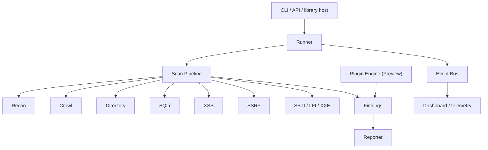
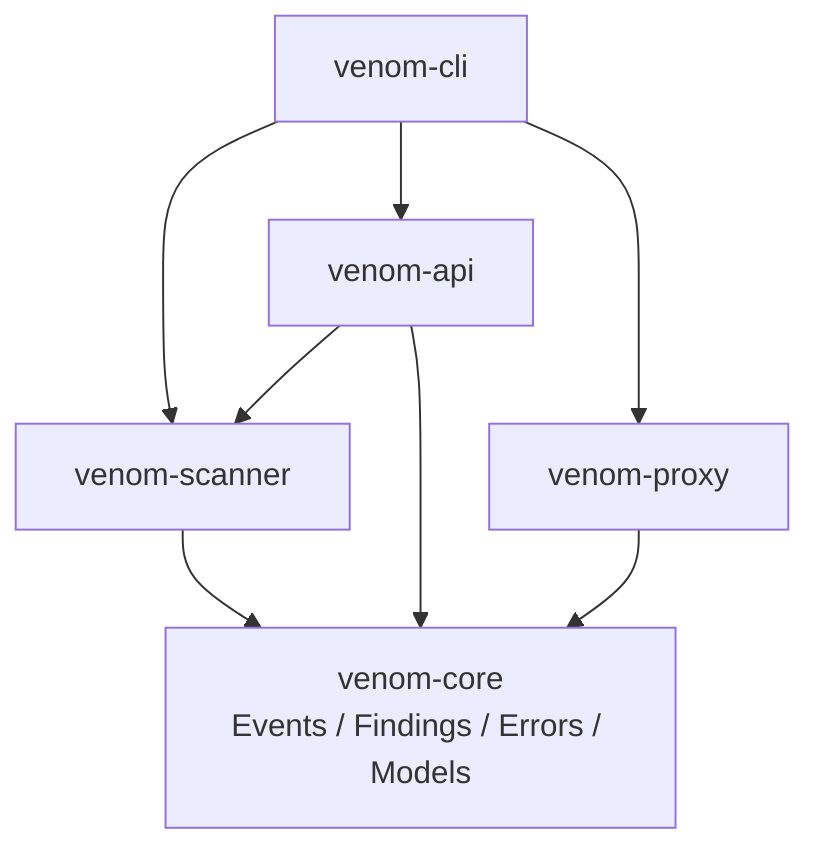

# Venom

[](https://github.com/ITherso/venom/actions/workflows/tests.yml)
[](https://itherso.github.io/venom/)
[](LICENSE)
[](https://www.rust-lang.org/)
[](https://codecov.io/gh/ITherso/venom)

Venom is a modular Rust-based penetration testing framework focused on research and extensibility.

> Current release: **v0.9.0-alpha**. Venom is not production-ready. Use it only on systems you own or have explicit permission to test.

Capability maturity and known gaps are maintained in [FEATURES.md](FEATURES.md). Labels such as Beta, Preview, and Experimental describe lifecycle maturity, not completeness.

## Design principles

- **Safe Rust by default.** Unsafe code must be isolated, justified, and reviewed.
- **Dependency inversion.** Contracts point inward; entry points compose lower-level crates.
- **Async first.** Network and scan execution avoid blocking the runtime.
- **Modular boundaries.** Runners, phases, plugins, events, and reports communicate through narrow APIs.
- **Testability.** Behavior should be reproducible without starting the full application stack.
- **Security by default.** Authorization, least privilege, bounded inputs, and explicit failure are design requirements.

## Architecture



The plugin engine is currently a parallel library extension path; merging it with the ordered phase pipeline is pre-stable work.

### Dependency direction



Dependencies point inward toward `venom-core`. Entry-point and product features must never become dependencies of lower-level crates. See [Architecture](docs/architecture.md) for module ownership, the editable Draw.io source, and the target product-layer split.

## Repository structure

```text
venom/
|-- crates/       Rust workspace crates: core, scanner, API, proxy, and CLI
|-- docs/         Focused design, operating guides, and architecture.drawio
|-- templates/    cargo-generate starters, including the plugin SDK preview
|-- web/          Dashboard application and frontend assets
|-- fuzz/         cargo-fuzz targets and seed corpora
`-- examples/     Example configurations and authorized usage
```

The workspace map and dependency rules are expanded in [Architecture](docs/architecture.md).

## Release readiness

| Check | Status | Evidence or gap |
| --- | --- | --- |
| Unit tests | Automated | Stable, beta, and nightly CI |
| Integration tests | Automated | Service-backed test job |
| Coverage | Automated | Tarpaulin report uploaded to Codecov |
| Compile time and binary size | Automated | Quality Metrics workflow artifact |
| Criterion microbenchmarks | Partial | Automated suite; endpoint baseline not published |
| Fuzzing | Partial | Parser targets exist; continuous campaign not operating |
| Mutation testing | Missing | Mutation score is not yet measured |
| External security audit | Missing | No independent audit has been completed |
| Performance report | Missing | Controlled CPU, RAM, throughput, and latency report pending |
| Stable API | Preview | Public contracts may change during alpha |

This table is intentionally conservative. Passing CI does not make the scanner production-ready.

## Quick start

Requirements: Rust stable, Git, and an authorized test target.

```bash
git clone https://github.com/ITherso/venom.git
cd venom
cargo test --workspace
cargo run -p venom-cli -- --help
```

Run an authorized scan:

```bash
cargo run -p venom-cli -- scan https://test.example
```

## Plugin SDK preview

Generate a standalone plugin starter with [`cargo-generate`](https://cargo-generate.github.io/cargo-generate/):

```bash
cargo install cargo-generate
cargo generate \
  --git https://github.com/ITherso/venom \
  --subfolder templates/venom-plugin \
  --name my-venom-plugin
```

The template implements `Plugin`, registers it in a test, and tracks Venom `main` during alpha. Pin a release tag or commit before publishing a third-party plugin. See [Plugin development](docs/plugin.md).

## Documentation

- [Feature lifecycle](FEATURES.md)
- [Architecture](docs/architecture.md)
- [Editable architecture diagram](docs/architecture.drawio)
- [Runner](docs/runner.md)
- [Scanner](docs/scanner.md)
- [Plugin development](docs/plugin.md)
- [Distributed execution](docs/distributed.md)
- [Lua](docs/lua.md)
- [Benchmarks and metrics](docs/benchmarks.md)
- [Security policy](SECURITY.md)
- [Documentation site](https://itherso.github.io/venom/)
- [Rust API documentation](https://itherso.github.io/venom/rust/venom_scanner/)

## Roadmap

- Converge native plugins and ordered scan phases behind one versioned execution contract.
- Move dashboard, distributed orchestration, and compliance into an optional product layer.
- Publish browsable Criterion history and controlled performance baselines.
- Run bounded cargo-fuzz campaigns in CI and retain crash artifacts.
- Require cargo-deny alongside cargo-audit before release.
- Cut the first `v0.9.0-alpha` GitHub release after the published readiness gates pass.
- Continue hardening contribution rules, mutation testing, and independent security review.

Roadmap items are intentions, not delivery guarantees. See [CHANGELOG.md](CHANGELOG.md) for shipped changes.

## Contributing

Read [Contributing](docs/CONTRIBUTING.md), keep dependencies pointed inward, and run formatting, clippy, and tests before opening a pull request. Report vulnerabilities privately according to [SECURITY.md](SECURITY.md).

Venom is licensed under the MIT License.
