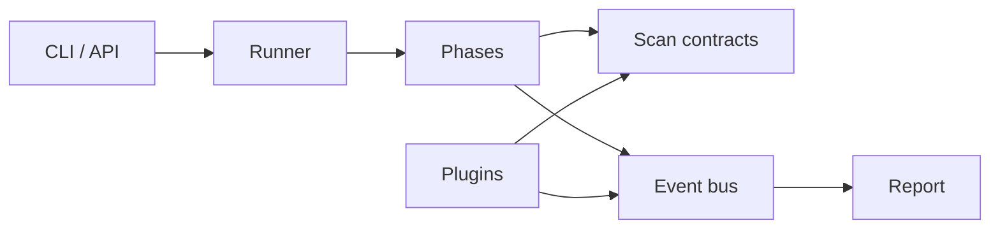
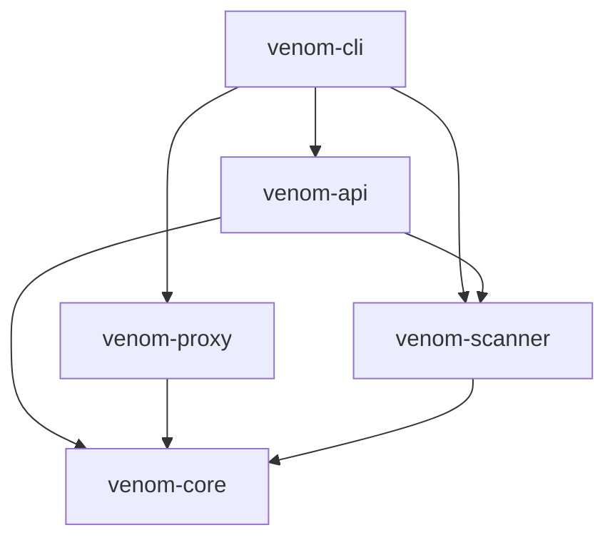

# Venom

Venom is an experimental, modular web security testing framework written in Rust.

> Current release: **v0.9.0-alpha**. Venom is not production-ready. Use it only on systems you own or have explicit permission to test.

## What is Venom?

Venom combines a command-line interface, an HTTP API, a proxy, and a multi-phase scanner in one Rust workspace. The project is designed for research, repeatable authorized testing, and experimentation with scanning pipelines.

The current alpha focuses on clear component boundaries and a small public contract between the runner, scan phases, plugins, events, and reports. Some optional modules are still experimental and their APIs may change before a stable release.

## Features

| Capability | Status | Notes |
| --- | --- | --- |
| Multi-phase web scanner | Beta | Reconnaissance through SSRF-oriented phases |
| CLI and HTTP API | Beta | Scan, API, and proxy entry points |
| MITM proxy | Experimental | Requires explicit authorization and local trust setup |
| Event bus and reporting | Beta | Structured scan lifecycle events and report models |
| Native plugins | Preview | Trait-based plugin registry and built-in detectors |
| Lua scripting | Preview | Sandboxed scripting controls are under active development |
| Anomaly detection | Experimental | Heuristic scoring; not a substitute for manual validation |
| Distributed execution | Experimental | Worker and queue APIs may change |
| Compliance and threat intelligence | Preview | Optional feature-gated modules |

Feature flags are documented in [scanner documentation](docs/scanner.md).

## Architecture

### Workspace map

```text
venom/
├── crates/
│   ├── venom-cli       # User-facing binary and command routing
│   ├── venom-api       # HTTP API surface
│   ├── venom-proxy     # HTTP/TLS proxy
│   ├── venom-core      # Shared configuration and error types
│   └── venom-scanner   # Scan orchestration and detection modules
├── docs/               # Focused design and operating documentation
├── examples/           # Example configuration and usage
└── fuzz/               # cargo-fuzz targets
```

### Scanner map

```text
venom-scanner/src/
├── phases/             # Ordered scanning stages
├── plugins/            # Built-in native plugins
├── contracts.rs        # Shared phase/plugin findings and execution traits
├── runner.rs           # Pipeline orchestration
├── event_bus.rs        # Lifecycle event publication
├── distributed.rs      # Workers, queues, and result aggregation
├── anomaly.rs          # Heuristic anomaly scoring
├── lua_engine.rs       # Lua execution boundary
├── reporting.rs        # Report models and rendering
└── lib.rs              # Feature gates and public API
```

### Runtime flow



### Crate dependencies



Dependency direction is inward toward `venom-core`; lower-level crates must not depend on entry-point crates. The editable Draw.io source and design rationale are in [Architecture](docs/architecture.md).

## Quick Start

### Requirements

- Rust stable toolchain
- Git
- A target you are authorized to test

```bash
git clone https://github.com/ITherso/venom.git
cd venom
cargo build --workspace
cargo test --workspace
```

Show the CLI help:

```bash
cargo run -p venom-cli -- --help
```

Run an authorized scan:

```bash
cargo run -p venom-cli -- scan https://test.example
```

## Examples

Start the local API:

```bash
cargo run -p venom-cli -- api --addr 127.0.0.1:8080
```

Start the local proxy:

```bash
cargo run -p venom-cli -- proxy --addr 127.0.0.1:8081
```

Build the scanner with optional research modules:

```bash
cargo build -p venom-scanner --features research
```

Run microbenchmarks:

```bash
cargo bench -p venom-scanner --bench scanner_benchmarks
```

See [Getting Started](docs/GETTING_STARTED.md) for configuration details and [Testing](docs/TESTING.md) for the test matrix.

## Roadmap

### Before v0.9.0-alpha release

- Stabilize the public scan and plugin contracts.
- Publish reproducible endpoint, CPU, memory, and latency baselines.
- Expand parser fuzzing and triage the initial corpus.
- Complete an independent security review.

### Toward v1.0.0

- Version and document the plugin SDK.
- Validate distributed execution under controlled load.
- Publish a stable configuration schema and migration policy.
- Publish the scaffolded MkDocs site and add an end-to-end demo.

Roadmap items are intentions, not delivery guarantees. See [CHANGELOG.md](CHANGELOG.md) for shipped changes.

## Contributing

Contributions are welcome. Before opening a pull request:

1. Read [Contributing](docs/CONTRIBUTING.md).
2. Keep crate dependencies pointed toward `venom-core`.
3. Run `cargo fmt --all -- --check`, `cargo clippy --workspace`, and `cargo test --workspace`.
4. Include tests and focused documentation for behavior changes.

For vulnerabilities, do not open a public issue. Follow [SECURITY.md](SECURITY.md).

Venom is licensed under the MIT License.
