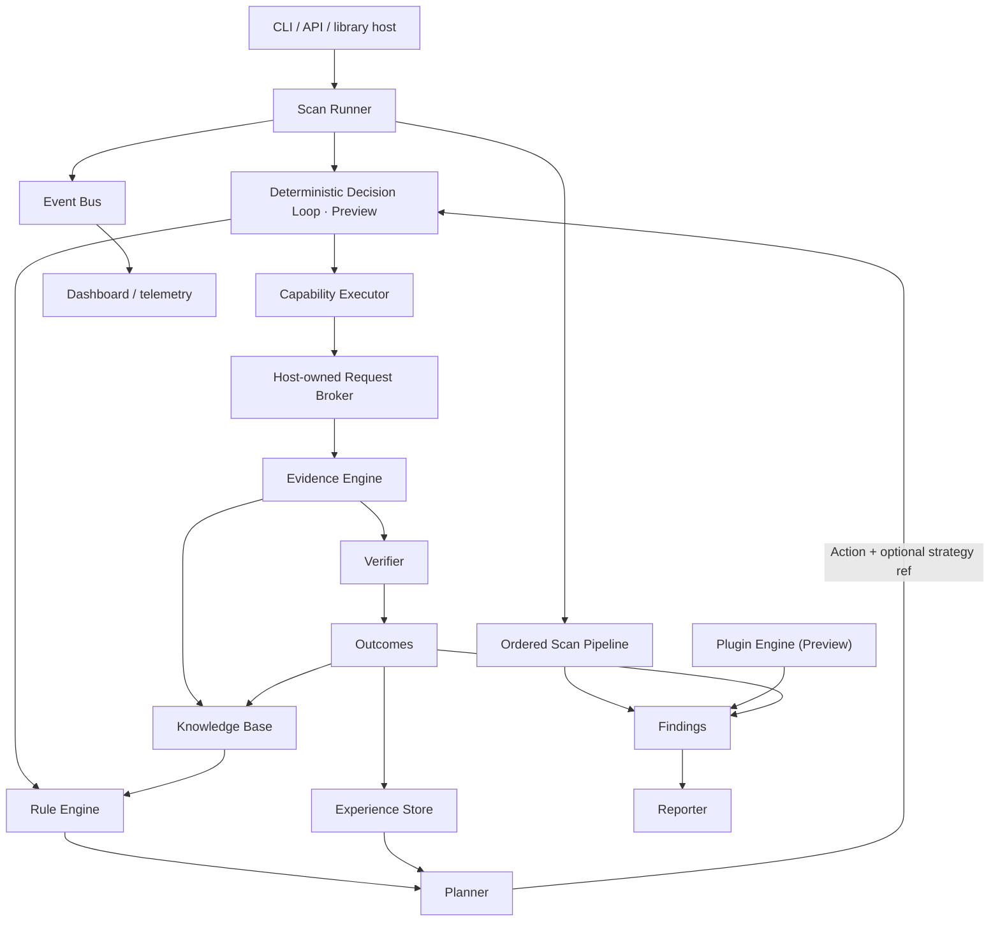
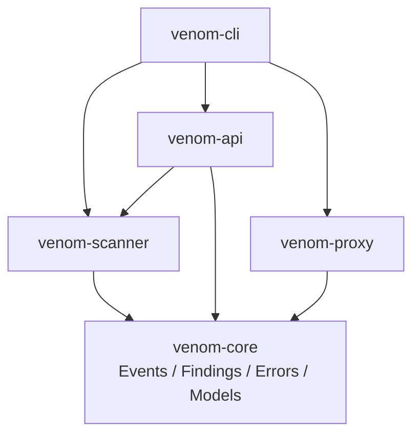

# Venom

[](https://github.com/ITherso/venom/actions/workflows/tests.yml)
[](https://itherso.github.io/venom/)
[](LICENSE)
[](https://www.rust-lang.org/)
[](https://codecov.io/gh/ITherso/venom)

Venom is a modular Rust-based penetration testing framework focused on research and extensibility.

> Current release: **v0.9.0-alpha**. Venom is not production-ready. Use it only on systems you own or have explicit permission to test.

> Design direction: **Venom does not fuzz everything. Venom decides what is worth fuzzing.** Planner-selected payload strategies are the deterministic foundation for that model; the ordered phase runner remains a documented legacy migration path.

Capability maturity and known gaps are maintained in [FEATURES.md](FEATURES.md). Labels such as Beta, Preview, and Experimental describe lifecycle maturity, not completeness.

Release gates, alpha rationale, and active blockers are maintained in [PROJECT_STATUS.md](PROJECT_STATUS.md).

## Design principles

- **Safe Rust in workspace crates.** Centrally inherited lints forbid unsafe code; any proposed exception requires an explicit policy and architecture change.
- **Dependency inversion.** Contracts point inward; entry points compose lower-level crates.
- **Async first.** Network and scan execution avoid blocking the runtime.
- **Modular boundaries.** Runners, phases, plugins, events, and reports communicate through narrow APIs.
- **Testability.** Behavior should be reproducible without starting the full application stack.
- **Security by default.** Authorization, least privilege, bounded inputs, and explicit failure are design requirements.

## Architecture



The deterministic path turns bounded observations into facts, hypotheses, plans, and reviewable outcomes. It does not use AI to make execution decisions or declare vulnerabilities. The plugin engine remains a parallel library extension path; merging it with the ordered phase pipeline is pre-stable work.

### Dependency direction



Dependencies point inward toward `venom-core`. Entry-point and product features must never become dependencies of lower-level crates. See [Architecture](docs/architecture.md) for module ownership, the editable Draw.io source, and the target product-layer split.

## Repository structure

```text
venom/
|-- crates/       Rust workspace crates: core, scanner, API, proxy, and CLI
|-- docs/         Focused design, operating guides, and architecture.drawio
|-- templates/    cargo-generate starters, including the plugin SDK preview
|-- xtask/        Repository commands for docs, benchmarks, release checks, and generation
|-- web/          Dashboard application and frontend assets
|-- fuzz/         cargo-fuzz targets and seed corpora
`-- examples/     Example configurations and authorized usage
```

The workspace map and dependency rules are expanded in [Architecture](docs/architecture.md).
The root `Cargo.toml` is a virtual manifest and intentionally has no `src/` directory. Only source files owned by workspace packages are built, tested, documented, released, and counted in project metrics.

## Release readiness

| Check | Status | Evidence or gap |
| --- | --- | --- |
| Unit tests | Automated | Stable, beta, and nightly CI |
| Integration tests | Automated | Service-backed test job |
| Coverage | Automated | Tarpaulin report uploaded to Codecov |
| Compile time and binary size | Automated | Quality Metrics workflow artifact |
| Criterion microbenchmarks | Published microbaseline | CI artifact and committed baseline; endpoint-scale results remain pending |
| Fuzzing | Scheduled + evidenced | Three product-semantic and five dependency-parser campaigns publish bounded reports |
| Mutation testing | Scoped experiment | Semantic policy mutations are measured manually; no permanent mutation CI yet |
| External security audit | Missing | No independent audit has been completed |
| Performance report | Missing | Controlled CPU, RAM, throughput, and latency report pending |
| Stable API | Preview | Public contracts may change during alpha |
| MSRV | Automated | Rust 1.88 plus stable, beta, and nightly CI |

This table is intentionally conservative. Passing CI does not make the scanner production-ready.

## Quick start

Requirements: Rust 1.88 or newer, Git, and an authorized test target.

```bash
git clone https://github.com/ITherso/venom.git
cd venom
cargo test --workspace
cargo run -p venom-cli -- --help
```

Run an authorized scan:

```bash
cargo run -p venom-cli -- scan https://test.example
```

## Examples

The repository includes small programs that compile in CI and exercise only public APIs:

```bash
cargo run -p venom-examples --bin basic_scan
cargo run -p venom-examples --bin custom_plugin
cargo run -p venom-examples --bin distributed_scan
```

`basic_scan` and `custom_plugin` use the reserved `.test` domain and perform no network request. `distributed_scan` demonstrates the in-process scheduling model; it is not a multi-node deployment example. Replace example targets only with systems you own or have explicit permission to test.

## Scanner SDK preview

Build a scanner from application-defined phases while Venom owns ordering, timeouts, events, telemetry, and finding aggregation:

```bash
cargo install cargo-generate
cargo xtask generate scanner my-scanner
```

See the [Scanner SDK guide](docs/sdk.md). The SDK is source-level and pre-stable during the alpha release line.

## Plugin SDK preview

Generate a standalone plugin starter with [`cargo-generate`](https://cargo-generate.github.io/cargo-generate/):

```bash
cargo install cargo-generate
cargo xtask generate plugin my-venom-plugin
```

The template implements `Plugin`, registers it in a test, and tracks Venom `main` during alpha. Pin a release tag or commit before publishing a third-party plugin. See [Plugin development](docs/plugin.md).

## Documentation

- [Feature lifecycle](FEATURES.md)
- [Project status and v1 gates](PROJECT_STATUS.md)
- [Architecture](docs/architecture.md)
- [Editable architecture diagram](docs/architecture.drawio)
- [Portable architecture SVG](docs/images/architecture.svg)
- [Runner](docs/runner.md)
- [Scanner](docs/scanner.md)
- [Scanner SDK](docs/sdk.md)
- [Plugin development](docs/plugin.md)
- [Plugin API and SemVer policy](docs/plugin-api-policy.md)
- [Architecture decisions](docs/adr/README.md)
- [Contributor internals](docs/internals/README.md)
- [Repository health](docs/repository-health.md)
- [Distributed execution](docs/distributed.md)
- [Lua](docs/lua.md)
- [Benchmarks and metrics](docs/benchmarks.md)
- [Security policy](SECURITY.md)
- [Documentation site](https://itherso.github.io/venom/)
- [Rust API documentation](https://itherso.github.io/venom/rust/venom_scanner/)

## Roadmap

- Converge native plugins and ordered scan phases behind one versioned execution contract.
- Move dashboard, distributed orchestration, and compliance into an optional product layer.
- Publish browsable Criterion history and controlled performance baselines.
- Expand fuzz corpora and publish triage guidance for reproducible crashes.
- Establish a blocking `venom-scanner` baseline from the next post-migration Preview release.
- Validate the 10-minute SDK and plugin path with external adopters and contributors.
- Continue hardening contribution rules, mutation testing, and independent security review.

Roadmap items are intentions, not delivery guarantees. See [CHANGELOG.md](CHANGELOG.md) for shipped changes.

## Contributing

Read [CONTRIBUTING.md](CONTRIBUTING.md) and the [Code of Conduct](CODE_OF_CONDUCT.md), or start with a scoped [`good first issue`](https://github.com/ITherso/venom/labels/good%20first%20issue). Keep dependencies pointed inward and run formatting, Clippy, and tests before opening a pull request. Report vulnerabilities privately according to [SECURITY.md](SECURITY.md).

## License

Venom is licensed under the [MIT License](LICENSE). Contributions are accepted under the same terms unless explicitly stated otherwise.
