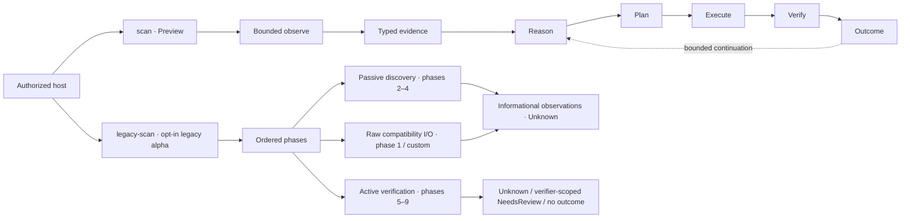

# Venom

[](https://github.com/ITherso/venom/actions/workflows/tests.yml)
[](https://itherso.github.io/venom/)
[](https://codecov.io/gh/ITherso/venom)
[](Cargo.toml)
[](LICENSE)

Venom is an experimental Rust security-testing project centered on a deterministic decision runtime that turns bounded web observations into typed evidence, hypotheses, risk-aware plans, and verifier-scoped outcomes.

> [!WARNING]
> **This remediated `0.10.0-alpha.1` source state is unreleased and not production-ready.** The historical `v0.9.0-alpha` binaries predate the bounded default runtime documented here and are not an installation path for this behavior. Build a reviewed, pinned commit from source and use it only on systems you own or are explicitly authorized to test. The default `scan` command is bounded, but it still makes network requests. The separately compiled `legacy-scan` has distinct bounded discovery and verification authorities, but phase one and custom extensions can still perform direct I/O outside `RuntimeBudget`, so its whole-run accounting is `Unmetered`. Preview and Experimental contracts may change.

**Why an action ran is not what it proved.** Venom keeps the evidence that motivates an action separate from the evidence that may change a hypothesis. An action can return `Success` after completing a knowledge-gathering objective without confirming its motivating hypothesis.



The two paths are separate. With no explicit profile, the deterministic runtime
emits operational decisions and outcomes under the unchanged
`decision-scan/v1` contract. The opt-in `web-review` profile adds typed passive
observations and matched low-risk review items. Those relationships remain
`Informational` or `NeedsReview`; none is a confirmed vulnerability.
`decision-scan` is a deprecated command alias for the same deterministic path;
it is not a second engine. Scanner SDK and plugin APIs are optional library
surfaces and are not silently inserted into `scan`.

## Choose the runtime surface

| Invocation | Authorized network envelope | Product output | Native assessment ceiling |
| --- | --- | --- | --- |
| `venom scan TARGET` | One decision subject under one exact-origin authority with no discovery crawl; 16 requests, 60 seconds, 1 MiB cumulative delivered-response threshold; redirects disabled | Text/`--explain` or unchanged `decision-scan/v1` JSON | No `AssessmentItem` projection |
| `venom scan TARGET --profile baseline` | The same conservative single-resource primitive and limits | Additive `web-assessment/v1` profile audit; assessment-report and authorization-context flags are rejected | No native review item |
| `venom scan TARGET --profile web-review` | Bounded exact-origin BFS under one budget, broker, cancellation authority, and scope policy | Completed `venom-rendered-assessment/v1`, or nonzero `web-assessment/v2` incompleteness with no partial file | `NeedsReview` |
| `venom legacy-scan ... --acknowledge-legacy-heuristics` | Separate bounded passive and active authorities, but phase-one/custom I/O keeps whole-run accounting `Unmetered` | Legacy compatibility observations and allowlisted verifier projections | `NeedsReview` |

The default command is therefore not a crawler. Origin discovery, passive
policy review, matched differential review, semantic extraction, and defense
shadow planning require explicit `--profile web-review`; assessment-file
output additionally requires its report option. Deterministic modes and the
built-in legacy brokers never silently expand authority across origins;
host-defined legacy extensions retain their separately documented raw-client
authority.

> [!NOTE]
> Venom has no supported API listener, `CONNECT`/TLS-intercepting MITM proxy,
> or durable multi-node control plane. The optional proxy adapter is only a
> fixed-upstream TCP relay, and distributed coordination remains an in-process
> host-library state machine.

## Why Venom is different

Venom uses a deliberately narrow claim vocabulary:

| Term | Meaning in the deterministic runtime |
| --- | --- |
| **Observed** | Directly present in bounded, typed evidence |
| **Supported** | Deterministic reasoning currently supports a hypothesis |
| **Confirmed** | A verifier-authorized, case-correlated transition occurred |
| **Success** | The action objective succeeded; confirmation may still be forbidden |

This distinction carries practical consequences: an observation is not a vulnerability, same-origin is not authorization, a bounded sample is not a complete inventory, and a successful action is not automatically a reportable finding.

Execution decisions are deterministic and model-independent. Venom does not require an LLM to select, authorize, or verify actions.

## What works today

| Area | Current implementation |
| --- | --- |
| Decision state | Immutable typed evidence, subject-scoped knowledge, deterministic rules, hypothesis lifecycle, and stale-snapshot rejection |
| Planning | Deterministic utility/information-gain ranking with requirements, prerequisites, cost, risk, suppression, stable tie-breaking, and claim-policy-aware targets |
| Verification | Passive and active stages, case-correlated evidence, verifier-owned transitions, and KnowledgeOnly objectives that cannot confirm a hypothesis |
| Continuation | Multi-objective replanning, Experience-based suppression, bounded counters, and host-policy-checked adaptive authority |
| Execution | Exact-origin, redirect-disabled transport actions through one metered request broker; a tested zero-I/O `LocalKnowledge` library contract |
| Output | Unchanged no-profile text/`--explain`/`decision-scan/v1`; explicit profile audits; and bounded JSON, CSV, HTML, or Markdown assessment reports for completed `web-review` runs |

The standard web profile currently has conservative, claim-specific behavior:

| Capability | What Venom can conclude |
| --- | --- |
| Nginx / Apache | A version-bearing server disclosure can directly confirm the matching technology hypothesis; a bare product token cannot |
| HTTP Basic / Bearer | A matching authentication challenge can confirm the corresponding boundary |
| Livewire | A direct Livewire response marker can confirm the matching hypothesis |
| PHP form controls | Collects bounded, names-only HTML control observations. The action is KnowledgeOnly: success does not confirm PHP |
| Laravel routes | Performs a bounded route-boundary check and preserves human-review semantics rather than confirming Laravel from a route response |
| Sanctum cookie surface | Records compatible cookie-name observations. The action is KnowledgeOnly and does not confirm Sanctum |

`LaravelInputAnalysis` remains unsupported in the standard executor catalog. The standard CLI profile uses transport-bound actions; `LocalKnowledge` is available to library hosts but has no built-in production action today.

### Explicit scan profiles

Omitting `--profile` preserves the conservative single-resource command and
the `decision-scan/v1` machine-output contract. Two strict built-in
`venom.scan-profile/v1` profiles are available:

```bash
cargo run -p venom-cli --locked -- scan https://authorized.example.test --profile baseline
cargo run -p venom-cli --locked -- scan https://authorized.example.test --profile web-review
```

`baseline` runs the same conservative single-resource decision primitive and
uses the additive `web-assessment/v1` profile audit. `web-review` opts into a
bounded exact-origin assessment: deterministic discovery, bounded semantic
extraction, defense observation and shadow planning, passive header/cookie
review, and a closed low-risk differential catalog all share one runtime
budget, request broker, cancellation authority, and exact-origin policy.
The native catalog is additive; it does not suppress otherwise eligible
standard actions on the authorized root.
Redirects remain disabled. Discovery does not turn a resource, form, or
parameter name into a vulnerability claim and never follows a cross-origin
reference.

The built-in CLI `web-review` profile fixes its envelope at 64 subjects at
depth two, 128 discovered references per document, 8,192 bytes per query-free
canonical URL, 512 KiB of retained URL bytes, 64 forms, 64 control names per
form, 64 candidate query names per route or form action, 256 total requests,
256 KiB per response, a 16 MiB cumulative delivered-response threshold, 300
seconds of wall time, eight active verifications, and concurrency one. The
broker charges one complete crossing chunk before typed response-byte
termination, so the cumulative threshold is not a byte-perfect retained-body
maximum. CLI profile limits are not user-overridable. Library hosts may select
checked limits up to separate compiled hard maxima; values above those maxima
fail closed.

Defense enforcement is OFF by default. Explicit `--enforce-defense` can only
remove or suppress already-authorized candidates through the monotonic defense
mapping; shadow audit may record Allow, Deprioritize, or Suppress. Enforcement
never adds or reorders actions, raises utility or intensity, expands scope or
budget, invents evasion behavior, or delays work.

The passive review observes HSTS, CSP, X-Content-Type-Options,
Referrer-Policy, Permissions-Policy, and cookie attributes without retaining
cookie values. The opt-in differential catalog runs only on the explicitly
authorized starting resource. It compares a no-`Origin` control with a
deterministic external-origin candidate for CORS review. If the starting URL
already supplied a recognized navigation query-parameter name, it also
compares a query-free control with one deterministic `.invalid` external
destination without following redirects. Query values from the user are never
retained or replayed.

At most one deterministic parameter from the root or a discovered exact-origin
resource receives SQL structural review. Two independent matched pairs use a
scanner-owned token and one unmatched quote only. A `NeedsReview` item requires
the same status-class and normalized HTML/JSON structure difference on replay;
error text, payload delivery, reflection, and latency alone are ignored.

The same bounded parameter selection may run one initial versioned SSTI probe
family. Two independent small arithmetic expressions must each produce their
exact scanner-predicted result while both controls remain absent. Literal
reflection, static numbers, generic errors, unrelated differences, unsupported
media, truncation, or an inconsistent replay produce no SSTI item (or typed
incompleteness where evidence collection was incomplete). A matched result is
only `NeedsReview`; this capability performs no command execution or stronger
template-engine verification.

Credentialed candidate-specific CORS requires matched successful-status
control/candidate responses; it and an exact candidate-specific external
redirect relationship can produce only `NeedsReview`. Exact reflection in
inert, text, or ordinary attribute context is `Informational`; a dangerous HTML
context is `NeedsReview`. No browser executes the response, so reflection is
never `Confirmed` XSS. The catalog is KnowledgeOnly and has no path to a
`Confirmed` assessment item.
Non-HTML is explicitly not applicable to reflection review; truncation,
invalid UTF-8, or an exhausted parser ceiling makes the opt-in review run
incomplete rather than silently successful.
Stable item identity preserves `authorized-root@1` for `/` and gives eligible
discovered exact-origin resources an opaque `discovered-resource@1` identity
derived from non-secret canonical structure and parameter names, never values.

An additional explicit `web-review` option can compare the exact origin root
once as anonymous and once with a host-supplied `Authorization` context. Use
`--auth-env`, `--auth-file`, or `--auth-stdin`; there is deliberately no raw
credential command-line flag. Credentialed review requires HTTPS; numeric-IP
loopback HTTP is accepted only for deterministic local fixtures. `--auth-file`
accepts a regular, non-symlink file, while `--auth-stdin` deliberately waits for
EOF and therefore remains under the invoking host's input/lifecycle control.
The two active requests share the assessment's
broker, budget, cancellation, deadline, and exact-origin policy, and redirects
remain disabled. Equal JSON visibility produces no item. A complete visibility
difference is retained as one atomic comparison evidence reference and can
produce only `NeedsReview`; it is never split into invented control/candidate
records and never becomes authorization-vulnerability confirmation. The
default web-review envelope permits at most eight active verifications: six for
the closed native catalog and two for this optional pair. Lower library-host
limits still fail closed.

## Try the deterministic runtime

Requirements: Rust 1.88 or newer, Git, and an authorized reachable HTTP(S) origin.

```bash
git clone https://github.com/ITherso/venom.git
cd venom
REVIEWED_COMMIT="REPLACE_WITH_THE_REVIEWED_FULL_COMMIT_SHA"
test "$REVIEWED_COMMIT" != "REPLACE_WITH_THE_REVIEWED_FULL_COMMIT_SHA"
git checkout --detach "$REVIEWED_COMMIT"
test "$(git rev-parse HEAD)" = "$REVIEWED_COMMIT"
cargo run -p venom-cli --locked -- scan https://authorized.example.test
```

`example.test` is a reserved placeholder. Replace it with an origin you own or are explicitly permitted to assess.

Inspect the decision chain or consume structured diagnostics:

```bash
cargo run -p venom-cli --locked -- scan https://authorized.example.test --explain
cargo run -p venom-cli --locked -- scan https://authorized.example.test --format json
```

`--explain` expands the text report. JSON already contains the full diagnostics and uses the documented, historically named [`decision-scan/v1`](docs/internals/decision-scan-json-v1.md) schema, so the two flags cannot be combined. The deprecated, discoverable `decision-scan` compatibility alias accepts the same options and produces identical stdout and stderr.

The Preview profile enforces fixed request, wall-time, response-byte, request-body, active-verification, same-action, and no-progress limits. Redirects are disabled and every built-in request competes for the same runtime budget.

Completed `web-review` runs use the central bounded assessment renderer and
schema `venom-rendered-assessment/v1`. Without `--report-format`, text selects
Markdown and `--format json` selects JSON. An explicit report format can select
any supported encoding:

```bash
cargo run -p venom-cli --locked -- scan https://authorized.example.test \
  --profile web-review --report-format csv
cargo run -p venom-cli --locked -- scan https://authorized.example.test \
  --profile web-review --report-format html --report-output assessment.html
cargo run -p venom-cli --locked -- scan https://authorized.example.test \
  --profile web-review --report-format json --auth-env VENOM_AUTH_CONTEXT
```

Populate `VENOM_AUTH_CONTEXT` through the host's secret-management mechanism,
not as a literal command argument. Authorization-context review requires the
exact origin root (`/`) and an authenticated transport, except for numeric-IP
loopback HTTP fixtures. Obvious report-output errors and target/profile policy
failures are rejected before the source is read. Source names, paths,
credential values, raw JSON bodies, cookies, and authorization headers are not
emitted in reports or debug output.

The central renderer fails closed above its 16 MiB hard ceiling. JSON, CSV,
HTML, and Markdown preserve the distinction between `Informational` and
`NeedsReview`; rendering never upgrades or invents a disposition.

`--report-output` requires `--report-format`, creates a new file atomically
through a same-directory temporary file and hard link, and never overwrites an
existing destination. The file contents are synchronized before publication,
but directory-metadata crash durability is best effort; a filesystem without
the required hard-link semantics fails nonzero. An incomplete or started-failed
`web-review` run instead emits a redacted `web-assessment/v2` diagnostic audit
to stdout, returns nonzero, and creates no requested report artifact.

### Legacy ordered scanner

The historical ordered runner is absent from default builds. It can be compiled explicitly and requires acknowledgement at invocation:

```bash
cargo run -p venom-cli --locked --features legacy-scanner -- legacy-scan \
  https://authorized.example.test --acknowledge-legacy-heuristics
```

`legacy-scan` runs the historical heuristic phase pipeline. Its crawler,
wordlist-based directory discovery, and parameter discovery share a passive,
exact-origin, redirect-disabled broker with finite depth, page, request,
request-timeout, wall-time, cumulative-body, and per-response-body limits.
Directory discovery remains separately disabled unless
`--legacy-directory-fuzz` is supplied. These phases commit typed discovery state
atomically and produce only informational observations: directory candidates
must differ from two stable randomized nonexistent-path controls in the same
parent namespace and path shape, while parameters must
pass a reproducible baseline/control/candidate/replay comparison.

Phases five through nine use a second exact-origin, redirect- and
retry-disabled authority accounted at the `Active` stage. `VerificationLimits`
bounds its requests, per-request timeout, shared wall time, cumulative delivered
body bytes, and retained bytes per response. SQL behavior and template
arithmetic differentials—and an SDK host's explicitly configured benign local-file
canary—can produce verifier-owned, knowledge-only `NeedsReview` outcomes. Exact
reflection remains an `Unknown` observation because no browser-execution
verifier exists. XXE is inert; SSRF is inert by default, and an SDK host's
explicit OOB delivery records only a nonce-bearing probe receipt. The current
legacy contract has no callback verifier and produces no SSRF outcome. No
cloud-metadata or sensitive-file probe is compiled as a default.

That scoped boundary does not make the historical runner a bounded decision
runtime. Phase one and custom `ScanPhase` extensions can retain direct I/O
outside `StandardWebDecisionRuntime` and both bounded authorities, so the
complete run remains `Unmetered`. CLI output deliberately withholds unverified
phase detail; raw compatibility records project as `Unknown`, while only the
allowlisted verifier bridge can project the `NeedsReview` outcomes above. See
[ADR 0016](docs/adr/0016-bound-legacy-discovery-authority.md) and
[ADR 0018](docs/adr/0018-bound-legacy-verification-authority.md).

See the [runtime map](docs/internals/runtime-map.md) for the exact module and command inventory.

## What Venom does not claim

- An observed Nginx or Apache version is not, by itself, a vulnerability.
- Named HTML controls do not confirm PHP, and control values are never copied into form-control evidence.
- Sanctum-compatible cookie names do not confirm Laravel Sanctum.
- A same-origin route is not authorization to request it; the host remains the authority boundary.
- Missing evidence in a bounded or truncated sample is not evidence of absence.
- Successful execution is not automatically confirmation, a finding, or a vulnerability claim.
- An `AssessmentItem` observation can be `Informational`; a matched differential may justify `NeedsReview`; only a verifier-authorized, case-correlated transition under a confirming claim policy may be `Confirmed`.
- A repeated SQL timing differential, exact text reflection, or template-arithmetic result still requires claim-specific review; none is an exploit or vulnerability verdict.
- Delivering an OOB callback URL to the target is not evidence that the target made the callback. HTTP 200, 401, or 403 is only the probe response.
- JSON/GraphQL fingerprints and paired visibility differences remain observations or review hypotheses unless a dedicated verifier says otherwise.

## Runtime surfaces

| Surface | Status | Current boundary |
| --- | --- | --- |
| `venom scan` | Preview | No-profile conservative single-resource runtime keeps text, explain, and `decision-scan/v1`; explicit `baseline` and exact-origin `web-review` are additive profile-v1 surfaces |
| `venom decision-scan` | Deprecated alias | Compatibility name for the same deterministic command and engine; the wire schema remains `decision-scan/v1` |
| `venom legacy-scan` | Legacy alpha, opt-in | Historical mixed-authority pipeline: phases 2–4 share bounded passive discovery, phases 5–9 share separate bounded active verification, and phase-one/custom raw I/O keeps the whole run `Unmetered`; requires `legacy-scanner` and explicit acknowledgement |
| Scanner SDK | Legacy, opt-in | Historical source-level phase-composition facade behind `legacy-scanner`; it is covered by a same-revision compile fixture, not an accepted stable SDK baseline |
| Native plugin API 0.2 | Preview, opt-in | Source-linked host extensions receive a host-owned bounded context and record evidence-only observations, not findings. No stock detector plugins ship, and plugins are not merged into the default runtime |
| Run-report renderer | Preview, opt-in | Standalone `reporting` renders a host-pre-redacted `RunReport`; `scanning + reporting` also composes completed runtime-owned web-review truth into typed assessment reports, and the CLI uses that central renderer for completed web-review output. The renderer performs no I/O, persistence, risk synthesis, or verdict invention |
| Lua execution | Experimental, opt-in | Implemented bounded, cooperative in-process Lua 5.4 registry/executor for explicit library hosts; no standard libraries, process isolation, plugin bridge, scanner phase, or repository CLI caller |
| Distributed coordination | Experimental, opt-in | Implemented deterministic, bounded in-process task/worker/result state machines for explicit library hosts; no transport, authentication, serialization, persistence, ambient clock, background work, or multi-node control plane |
| `venom api` | Unsupported, opt-in | Absent from default builds; the `api-adapter` feature reports that no listener is implemented |
| `venom proxy` | Experimental, opt-in | Absent from default builds; `proxy-adapter` exposes an explicit fixed-upstream TCP relay with no `CONNECT`, TLS termination, certificate generation, or HTTP inspection |

Lua and distributed coordination are implemented Experimental host-library
surfaces, but no repository runtime calls them. Dashboard, monitoring,
compliance, threat-intelligence, and related modules remain optional,
host-owned, compile-only, or experimental depending on the feature. None runs
in the default deterministic path or `legacy-scan`. The [runtime
map](docs/internals/runtime-map.md) is the source of truth.

The scanner crate's default feature closure is exactly `core` plus `scanning`.
Historical phases, platform data models, native plugins, Lua, and distributed
workers require the independent `legacy-scanner`, `platform-models`, `plugins`,
`lua`, and `distributed` features. The default CLI dependency additionally
enables `reporting` so a completed explicit `web-review` run reaches the same
bounded renderer used by library hosts. The CLI's unsupported API hook and
experimental relay require `api-adapter` and `proxy-adapter`.

## Quality and robustness

| Control | Current evidence | Important limit |
| --- | --- | --- |
| Tests | Unit, integration, doc, security, template, and architecture jobs in [CI](.github/workflows/tests.yml) | Passing CI is not production readiness |
| Rust compatibility | MSRV 1.88 plus stable, beta, and nightly | Pre-stable APIs may still change |
| Cross-platform runtime smoke | Focused Rust 1.88 default-CLI and loopback checks on Ubuntu, Windows, and macOS | A small hosted-runner smoke matrix is not platform certification or broad all-feature support |
| Coverage | Final integration evidence covers 36,716/41,744 in-scope source lines (87.96%); pinned Tarpaulin's LLVM backend enforces the accepted [exact baseline](docs/reports/coverage/6edc4d925739.md) and the same exact ratio on coverable changed lines, while `venom.coverage.v2` binds a normalized line-state digest | Coverage is a scoped navigation signal, not proof of test adequacy; the advisory [Codecov](https://codecov.io/gh/ITherso/venom) upload is best-effort and tokenless availability is not enforced |
| Safe Rust / boundaries | Workspace crates forbid unsafe code; architecture checks enforce dependency and transport ownership | Static boundaries do not prove semantic correctness |
| Public API compatibility | Blocking SemVer comparison for `venom-core` plus four isolated [current-head consumer fixtures](docs/public-api-compatibility.md) | Same-revision compilation is not cross-version compatibility, a stable ABI, or external adoption; Scanner SDK and plugin baselines remain open |
| Security scanning | RustSec, cargo-deny, Semgrep CE, Trivy, Dependabot, and scoped CodeQL | Automated scanners have false positives and false negatives |
| Fuzzing | PR seed replay and compile checks; bounded scheduled/manual campaigns for four product-semantic and five parser targets | Time-bounded fuzzing is not a safety proof |
| Mutation testing | Scoped, evidenced campaigns for selected policy, planner, runtime, and extraction contracts | No permanent mutation farm or project-wide score |
| Performance | [Initial controlled endpoint evidence](docs/reports/benchmarks/27321ef-endpoint-assessment.md) from source `27321ef` and run `33292247976` covers three samples of fixed 1 ms loopback fixtures at concurrency one; the 10,000-request workload is a batch of ten independent authorities | One workflow run provides intra-run variance only; no repeatable accepted baseline, threshold, capacity claim, or SLA exists |
| Independent audit | Not completed | External review remains a stable-release gate |

See [Fuzzing](docs/fuzzing.md), [Quality metrics](docs/quality-metrics.md), [Repository health](docs/repository-health.md), and [Project status](PROJECT_STATUS.md) for scope and caveats.

## Project status

The latest published tag, **v0.9.0-alpha**, is historical and predates this source contract; `main` targets the next Preview release. Build from a reviewed, pinned source commit until a remediated tag exists. Alpha means public contracts, output details, and integration boundaries may change. Lifecycle labels describe maturity, not completeness:

- [Feature lifecycle](FEATURES.md)
- [Stable-release gates and active blockers](PROJECT_STATUS.md)
- [Changelog](CHANGELOG.md)

| Stable-release gate | Current truth |
| --- | --- |
| Internal deterministic CI | Implemented and green on the reviewed integration stack; this is not an external assessment |
| Independent security audit | Open: [#6](https://github.com/ITherso/venom/issues/6) |
| Independent version-pinned adoption | Open: [#63](https://github.com/ITherso/venom/issues/63); maintainer fixtures do not count |
| Scanner SDK/plugin compatibility and deprecation baseline | Open: [#4](https://github.com/ITherso/venom/issues/4) and [#8](https://github.com/ITherso/venom/issues/8) |
| Repeatable endpoint-performance baseline | Open: [#5](https://github.com/ITherso/venom/issues/5); one workflow record is not a threshold or SLA |
| Supported API listener / MITM proxy | Absent |
| Durable authenticated distributed control plane | Absent: [#7](https://github.com/ITherso/venom/issues/7); only process-local state machines exist |

The committed same-revision fixtures, internal gates, and first endpoint
workflow record close neither the external gates nor the product gaps above.

## Repository layout

```text
crates/       Rust workspace crates: core, scanner, CLI, API adapter, proxy relay
docs/         Architecture, operating guides, ADRs, and contributor internals
fuzz/         cargo-fuzz harnesses and reviewed seed corpora
templates/    Scanner SDK and plugin starter templates
xtask/        Repository validation, docs, release, benchmark, and generator tasks
examples/     Small public-API examples compiled in CI
web/          Disconnected dashboard preview; not a scan-runtime component
profiles/     Executable built-in profile contract notes; no custom profile-file loader
```

The root `Cargo.toml` is a virtual workspace manifest. Runtime ownership and feature participation are documented in [Architecture](docs/architecture.md) and the [runtime map](docs/internals/runtime-map.md).

## Scanner SDK and plugins

Both generated starters compile in CI, but they do not share one lifecycle.
The Scanner SDK starter exercises the historical Legacy facade; the native
plugin starter targets the evidence-only Preview API 0.2 line. The plugin
starter is an INFO-only trait-boundary fixture: Venom ships no stock detector
plugins, and plugin observations still require host reasoning and verification
before any finding projection. The four separately tested current-head
consumers share one dedicated lockfile and provide same-revision compile
evidence only; see [Public API compatibility status](docs/public-api-compatibility.md).

```bash
cargo install cargo-generate
cargo xtask generate scanner my-scanner
cargo xtask generate plugin my-venom-plugin
```

See the [Scanner SDK guide](docs/sdk.md), [Plugin development](docs/plugin.md),
and [plugin API policy](docs/plugin-api-policy.md). Until a remediated Preview
tag and accepted cross-version baseline exist, pin a reviewed full commit.
`ScannerSdk` remains Legacy; deterministic assessment/reporting and plugin API
0.2 remain Preview.

## Documentation

- [Getting started](docs/GETTING_STARTED.md)
- [Distribution and installation](docs/DISTRIBUTION.md)
- [Architecture](docs/architecture.md)
- [Runtime map: what actually runs](docs/internals/runtime-map.md)
- [Lua execution](docs/lua.md)
- [Distributed coordination](docs/distributed.md)
- [Decision runner](docs/internals/decision-runner.md)
- [Web execution](docs/internals/web-execution.md)
- [Web verification](docs/internals/web-verification.md)
- [`decision-scan/v1` JSON](docs/internals/decision-scan-json-v1.md)
- [Fuzzing](docs/fuzzing.md)
- [Security policy](SECURITY.md)
- [Documentation site](https://itherso.github.io/venom/)
- [Rust API documentation](https://itherso.github.io/venom/rust/venom_scanner/)

## Roadmap

- Select and baseline the intended deterministic scanner and plugin contracts,
  while keeping the Legacy `ScannerSdk` facade outside any v1 claim until its
  migration and deprecation policy is explicit.
- Strengthen evidence lineage, replay/provenance contracts, and bounded application-structure semantics before adding broader domain behavior.
- Expand reviewed semantic corpora and scoped mutation coverage without turning either technique into a completeness claim.
- Repeat the controlled endpoint workloads on a comparable pinned hardware class and review inter-run variance before proposing a regression baseline or threshold.
- Complete an independent security review and validate the contributor/SDK path with external adopters.
- Explore bounded framework/CMS profiles only after their evidence, authorization, and claim policies are explicit; no WordPress or full Laravel scanner ships today.

Roadmap items are intentions, not delivery guarantees. Deterministic execution remains the authority boundary; any future model-assisted explanation or correlation layer must not silently control execution.

## Contributing

Read [CONTRIBUTING.md](CONTRIBUTING.md) and the [Code of Conduct](CODE_OF_CONDUCT.md), or start with a scoped [`good first issue`](https://github.com/ITherso/venom/labels/good%20first%20issue). Keep dependencies pointed inward and run formatting, Clippy, and tests before opening a pull request. Report vulnerabilities privately according to [SECURITY.md](SECURITY.md).

## License

Venom is licensed under the [MIT License](LICENSE). Contributions are accepted under the same terms unless explicitly stated otherwise.
