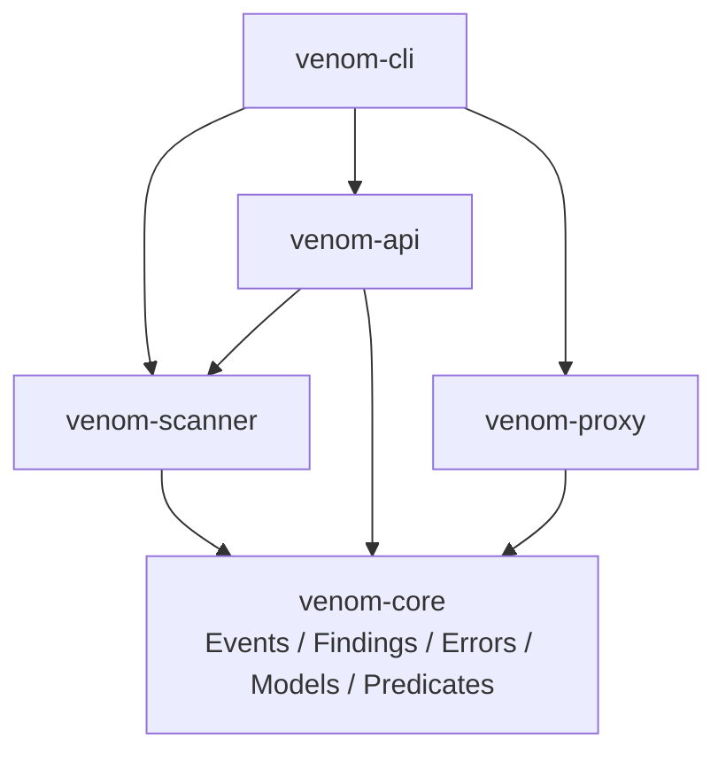
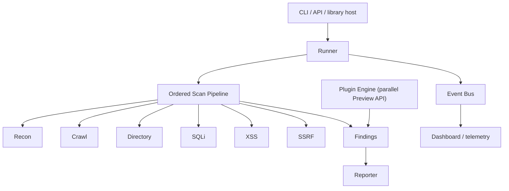
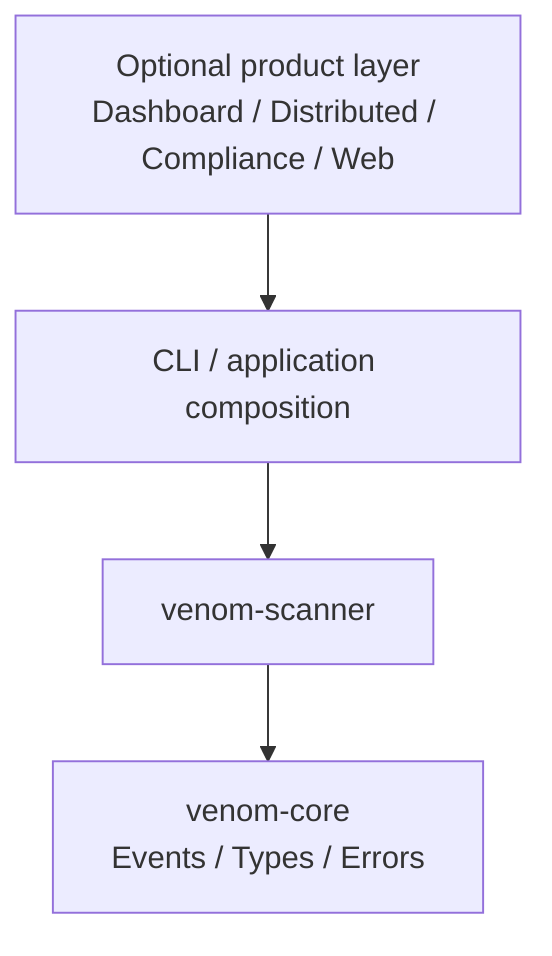
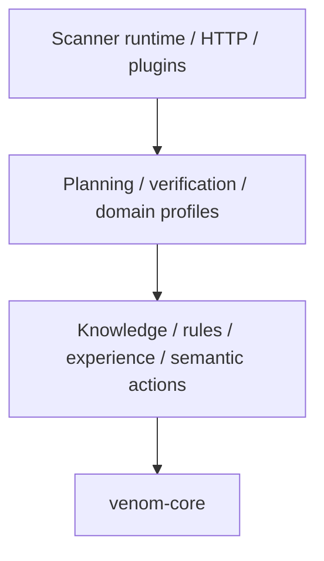

# Architecture

This document defines dependency direction and runtime ownership for Venom `0.9.0-alpha`. It is a design contract, not a production-readiness claim.

The editable diagrams.net source is [architecture.drawio](architecture.drawio). A presentation- and print-friendly export is available as [architecture.svg](images/architecture.svg).


## Current workspace

| Crate | Responsibility | May depend on |
| --- | --- | --- |
| `venom-core` | Transport-neutral events, findings, configuration, models, errors, and predicate vocabulary | External libraries only |
| `venom-scanner` | Phase/plugin traits, deterministic reasoning, runner, detection, and reports | `venom-core` |
| `venom-proxy` | HTTP/TLS proxy boundary | `venom-core` |
| `venom-api` | HTTP application transport | `venom-core`, `venom-scanner` |
| `venom-cli` | Composition root and command routing | All application crates |

`xtask` is repository tooling rather than a runtime layer. It may orchestrate workspace commands but application crates must not depend on it.



`Event`, `EventType`, `EventSeverity`, and `ScanFinding` live in `venom-core`. The scanner owns behavior such as `EventBus`, `ScanRunner`, `ScanPhase`, and `Plugin`. Scanner re-exports the core contracts so alpha consumers keep their existing import paths.

No lower-level crate may depend on `venom-cli` or `venom-api`. A cycle between workspace crates is a release blocker.

## Runtime ownership



The runner knows `ScanPhase`, not concrete phase implementations. The plugin registry knows `Plugin`, not concrete plugin types. Today these are parallel execution paths; convergence behind a versioned request context is required before a stable plugin SDK.

## Scanner modules

```text
venom-scanner/src/
|-- phases/          ordered scan implementations
|-- plugins/         built-in Plugin implementations
|-- contracts.rs     scanner traits and core contract re-exports
|-- runner.rs        scheduling, timeouts, cancellation, aggregation
|-- event_bus.rs     publish/subscribe behavior over core Event values
|-- reporting.rs     findings-to-report transformation
|-- distributed.rs   task queues and workers
|-- anomaly.rs       heuristic scoring
`-- lua_engine.rs    Lua lifecycle and limits
```

## Target product-layer split

Dashboard, distributed orchestration, compliance, and web application concerns should move outward once their contracts stabilize.



This target supports separate open-source and commercial distributions without making `venom-core` or `venom-scanner` aware of product policy. No placeholder `venom-enterprise` crate should be created until ownership, licensing, and stable interfaces are defined.

## Boundary rules

1. The CLI or application crate is the composition root.
2. The runner owns scheduling, timeout, cancellation, events, and aggregation, not detection logic.
3. Phases and plugins own detection behavior, not rendering or transport.
4. The event bus carries immutable lifecycle facts; subscribers do not control execution through hidden callbacks.
5. Distributed workers exchange serializable task/result contracts, not concrete runner or plugin objects.
6. Lua receives a deliberately small context and cannot access internal Rust state directly.
7. Reports consume findings after execution and do not mutate scanner state.

## Reasoning and runtime boundary

The decision engine remains inside `venom-scanner` during alpha, but its module
direction is treated as an extraction boundary rather than an informal style
preference.



| Protected layer | Modules | May import |
| --- | --- | --- |
| Evidence preparation | `api_evidence` | `venom-core` plus bounded JSON/hash libraries; never network, runtime, planner, or knowledge state |
| Reasoning state | `experience`, `rules` | `venom-core`; `rules` may also use `knowledge` |
| Planning and verification | `planner`, `verification` | `knowledge`, `rules`, `venom-core` |
| Semantic action, ingestion, and domain profiles | `web_actions`, `web_reasoning`, `api_reasoning`, `api_observation`, `web_planning`, `web_verification` | The lower rows above; never execution or HTTP modules |
| Execution and composition | `decision_runner`, `http_evidence`, `web_execution`, `web_runtime` | All inward contracts needed to perform and account for work |

`web_actions` owns stable semantic action and route identities. Planning,
verification, and execution are sibling consumers; an executor's HTTP method or
client policy never defines what the verifier is allowed to reason about.

`venom-core::predicates` owns the canonical HTTP observations, web conclusions,
API conclusions, and atomic paired-visibility contract shared by producers and
reasoners. `api_reasoning` consumes those transport-neutral contracts to infer
JSON/GraphQL fingerprints and reviewable visibility boundaries. It performs no
requests, does not combine independent observations into a pair, and never
declares a vulnerability.

HTTP execution emits normalized protocol observations for API reasoning:
validated lowercase media-type essences, an explicit JSON-compatibility flag,
and bounded path segments. A host-paired comparison becomes an
`ApiVisibilityObservation` containing one pseudonymous evidence record and one
stable, evidence-backed `api.visibility.resource-scope` edge. The knowledge
base's `insert_evidence_with_relation` operation preflights and commits that
pair under one write lock, so an identity or linkage conflict cannot leave an
orphaned half of the bundle. This is storage consistency, not proof that a
producer's comparison is true.

`api_evidence` is the pure Evidence Engine boundary for paired JSON views. It
canonicalizes under explicit hard ceilings, retains only raw-value-free
signatures, and produces the transport-neutral comparison contract. The
`api_observation` ingress then validates the expected resource, commits the
evidence/relation pair, applies rules to the isolated comparison subject, and
returns an auditable receipt. It does not weaken the decision runner's rule that
executor evidence must match the outstanding case subject. Resource-scoped
review is a cursor-bounded relation projection, not an implicit cross-subject
planner input. Rejected relation shapes consume the page budget and a compiled
ceiling prevents unbounded projection work. Stored relation IDs, endpoints,
custom kinds, and provenance sets also have hard size ceilings; pagination
checks look-ahead on the borrowed index without cloning the next record.

Bayesian contribution aggregation remains an explicit rule-level choice.
`EvidenceCalibration::new` defaults to `Independent`, preserving the behavior
of existing profiles. Each standard API calibration alone selects
`MaxContributions(1)`, limiting retry-driven posterior inflation for one
selector without changing other reasoning profiles.

A rule cycle evaluates every rule against one immutable subject snapshot and
preflights every matched hypothesis before committing the batch. Verifier-owned
`Confirmed` and `Rejected` states are preserved under that same write lock. A
late identity conflict therefore cannot commit only the earlier rule
conclusions or race a terminal verifier transition back to `Supported`.
Subject-local and ontology revisions provide a compare-and-swap boundary; a
stale cycle is re-evaluated under a fixed retry limit and then fails explicitly.
Verifier lifecycle transitions mutate only the latest stored state under the
knowledge lock, preserving concurrent belief and strength updates. Complete
verification reports carry the evaluated subject/ontology revisions; stale
reports are rejected, same-terminal replay is idempotent, and opposite terminal
transitions conflict instead of becoming last-writer-wins.

Run the machine-enforced boundary locally:

```bash
cargo xtask architecture
```

The command validates workspace dependencies through locked Cargo metadata,
inspects protected production imports through the Rust AST, verifies canonical
`lib.rs` module and external-root wiring, and compiles `venom-scanner` with no
default features. See [ADR 0004](adr/0004-reasoning-runtime-boundary.md).

## Dependency review

Before adding an edge, ask:

- Is the type transport-neutral and behavior-free enough for `venom-core`?
- Can the behavior live behind an existing trait?
- Does any API, dashboard, database, or deployment type leak into scanner logic?
- Can the module be tested without starting the CLI, API, proxy, or web panel?

## Known alpha debt

- Plugin inputs are still target and payload strings rather than a versioned request context.
- Native plugin execution and the ordered phase runner are separate orchestration paths.
- Dashboard, distributed, and compliance modules still live in `venom-scanner`.
- Several optional modules expose broad APIs that require stability review.
- `DecisionExecutionLimits` still names an HTTP response-body allowance in a
  generic executor request; it should become a transport-neutral resource
  allowance before extracting runner contracts.
