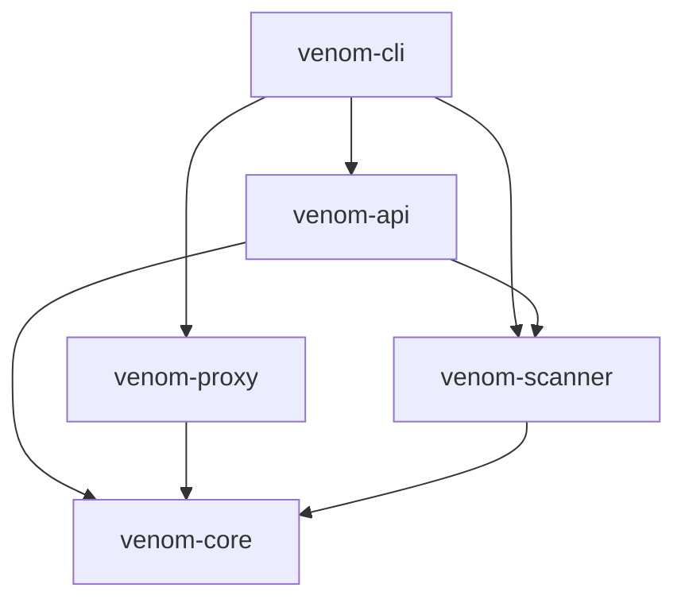
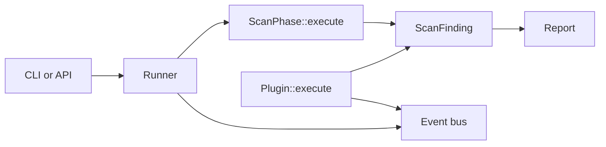

# Architecture

This document describes the intended dependency direction and runtime boundaries for Venom `0.9.0-alpha`. It is a design contract, not a claim that every experimental module is stable.

The editable diagrams.net source is [assets/venom-architecture.drawio](assets/venom-architecture.drawio). It contains separate runtime-flow and crate-dependency pages.

## Workspace

| Crate | Responsibility | May depend on |
| --- | --- | --- |
| `venom-core` | Shared configuration and error vocabulary | External libraries only |
| `venom-scanner` | Scan contracts, phases, plugins, events, and reports | `venom-core` |
| `venom-proxy` | HTTP/TLS proxy boundary | `venom-core` |
| `venom-api` | HTTP API and application-facing transport | `venom-core`, `venom-scanner` |
| `venom-cli` | Composition root and command routing | All application crates |



No lower-level crate may depend on `venom-cli` or `venom-api`. New shared types belong in `venom-core` only when they have no scanner-specific behavior.

## Scanner modules

```text
venom-scanner/src/
├── phases/          ordered scan implementations
├── plugins/         built-in Plugin implementations
├── contracts.rs     shared execution and finding contracts
├── runner.rs        stage scheduling, timeouts, cancellation
├── event_bus.rs     lifecycle notification boundary
├── reporting.rs     findings-to-report transformation
├── distributed.rs   task queues and workers
├── anomaly.rs       heuristic scoring
└── lua_engine.rs    Lua lifecycle and limits
```

## Runtime flow



The runner knows the `ScanPhase` contract, not concrete phase implementations. Native plugins are accessed through the `Plugin` trait and registry. A plugin must not reach into runner internals; it returns findings and emits observable state through public contracts.

## Boundary rules

1. The CLI is the composition root. Construction and wiring belong there or in a dedicated application layer.
2. The runner owns scheduling, timeout, cancellation, and aggregation—not detection logic.
3. Phases and plugins own detection behavior—not report rendering or transport.
4. The event bus carries immutable lifecycle facts; consumers must not control scan execution through hidden callbacks.
5. Distributed workers exchange serializable task/result contracts, not concrete runner or plugin objects.
6. Lua code receives a deliberately small context and cannot access internal Rust state directly.
7. Reports consume findings after execution and do not mutate scanner state.

## Dependency review

When adding a dependency, ask:

- Can this behavior live behind an existing trait?
- Does the dependency point toward `venom-core` rather than an entry-point crate?
- Does a transport type leak into scanner logic?
- Can the module be tested without starting the CLI, API, or proxy?

A cycle between workspace crates is a release blocker.

## Known alpha debt

- Plugin inputs still use target and payload strings; a versioned request context is planned before the stable plugin SDK.
- The native plugin execution path and ordered phase runner are separate orchestration paths.
- Several optional modules expose broad public APIs that need stability review.
- Legacy integration fixtures for distributed and Lua models need migration before being re-enabled.
