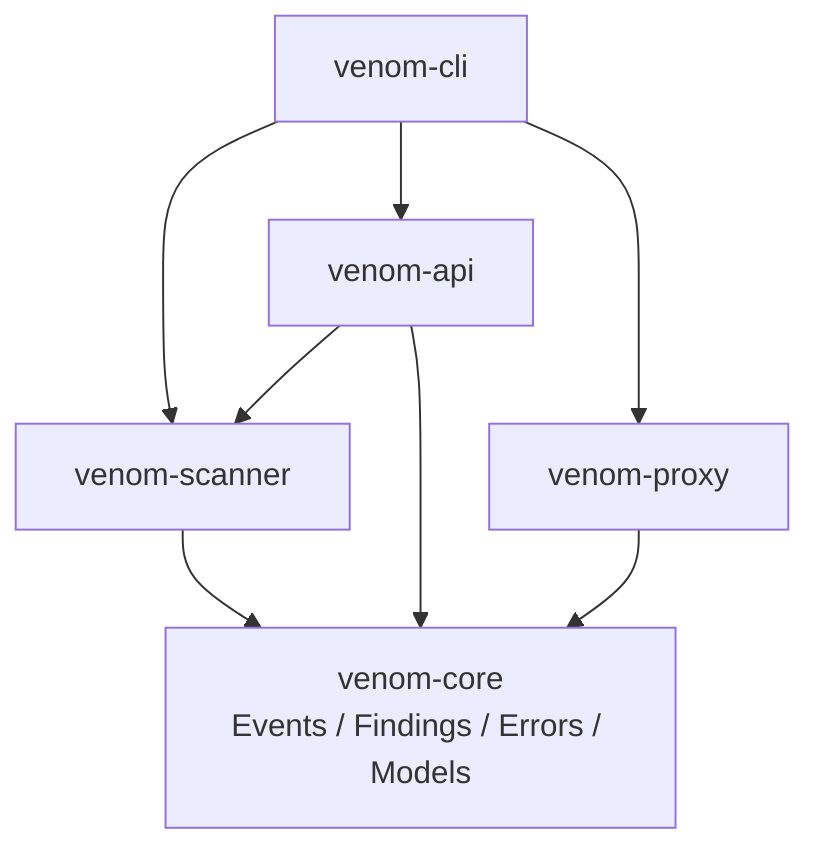
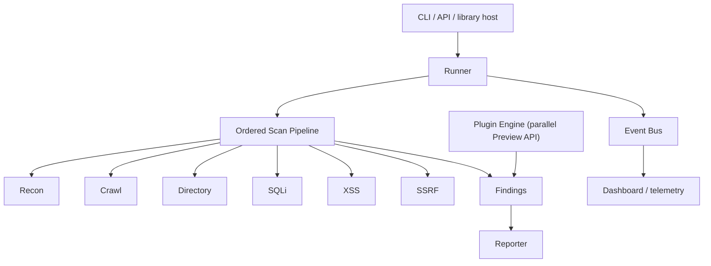
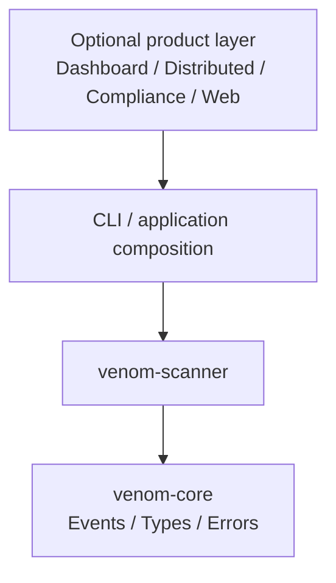

# Architecture

This document defines dependency direction and runtime ownership for Venom `0.9.0-alpha`. It is a design contract, not a production-readiness claim.

The editable diagrams.net source is [architecture.drawio](architecture.drawio). It is stored directly in `docs/` so contributors can find and update the non-Mermaid source without searching the repository.

## Current workspace

| Crate | Responsibility | May depend on |
| --- | --- | --- |
| `venom-core` | Transport-neutral events, findings, configuration, models, and errors | External libraries only |
| `venom-scanner` | Phase/plugin traits, runner, event bus behavior, detection, and reports | `venom-core` |
| `venom-proxy` | HTTP/TLS proxy boundary | `venom-core` |
| `venom-api` | HTTP application transport | `venom-core`, `venom-scanner` |
| `venom-cli` | Composition root and command routing | All application crates |

`xtask` is repository tooling rather than a runtime layer. It may orchestrate workspace commands but application crates must not depend on it.



`Event`, `EventType`, `EventSeverity`, and `ScanFinding` live in `venom-core`. The scanner owns behavior such as `EventBus`, `ScanRunner`, `ScanPhase`, and `Plugin`. Scanner re-exports the core contracts so alpha consumers keep their existing import paths.

No lower-level crate may depend on `venom-cli` or `venom-api`. A cycle between workspace crates is a release blocker.

## Runtime ownership



The runner knows `ScanPhase`, not concrete phase implementations. The plugin registry knows `Plugin`, not concrete plugin types. Today these are parallel execution paths; convergence behind a versioned request context is required before a stable plugin SDK.

## Scanner modules

```text
venom-scanner/src/
|-- phases/          ordered scan implementations
|-- plugins/         built-in Plugin implementations
|-- contracts.rs     scanner traits and core contract re-exports
|-- runner.rs        scheduling, timeouts, cancellation, aggregation
|-- event_bus.rs     publish/subscribe behavior over core Event values
|-- reporting.rs     findings-to-report transformation
|-- distributed.rs   task queues and workers
|-- anomaly.rs       heuristic scoring
`-- lua_engine.rs    Lua lifecycle and limits
```

## Target product-layer split

Dashboard, distributed orchestration, compliance, and web application concerns should move outward once their contracts stabilize.



This target supports separate open-source and commercial distributions without making `venom-core` or `venom-scanner` aware of product policy. No placeholder `venom-enterprise` crate should be created until ownership, licensing, and stable interfaces are defined.

## Boundary rules

1. The CLI or application crate is the composition root.
2. The runner owns scheduling, timeout, cancellation, events, and aggregation, not detection logic.
3. Phases and plugins own detection behavior, not rendering or transport.
4. The event bus carries immutable lifecycle facts; subscribers do not control execution through hidden callbacks.
5. Distributed workers exchange serializable task/result contracts, not concrete runner or plugin objects.
6. Lua receives a deliberately small context and cannot access internal Rust state directly.
7. Reports consume findings after execution and do not mutate scanner state.

## Dependency review

Before adding an edge, ask:

- Is the type transport-neutral and behavior-free enough for `venom-core`?
- Can the behavior live behind an existing trait?
- Does any API, dashboard, database, or deployment type leak into scanner logic?
- Can the module be tested without starting the CLI, API, proxy, or web panel?

## Known alpha debt

- Plugin inputs are still target and payload strings rather than a versioned request context.
- Native plugin execution and the ordered phase runner are separate orchestration paths.
- Dashboard, distributed, and compliance modules still live in `venom-scanner`.
- Several optional modules expose broad APIs that require stability review.
