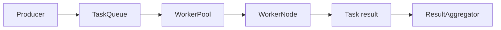

# Distributed execution

The optional `distributed` feature models scan tasks, priorities, worker state, queues, pools, and result aggregation. It is Experimental.

## Data flow

## Boundary rules

- Queue messages must be serializable, versioned, and bounded in size.
- Workers receive task data, not runner or plugin objects.
- Retries must be explicit and idempotency-aware.
- Heartbeats are observations, not proof that a task is making progress.
- Cancellation and lease expiry must have deterministic ownership rules.
- Aggregation must tolerate duplicate or late results.

## Security

Distributed control traffic requires authenticated peers, encrypted transport, replay resistance, tenant separation, and audit logging before use outside a trusted test environment. These controls are not claimed as complete in the alpha release.

## Testing priorities

Cover retry exhaustion, worker loss, duplicate delivery, stale heartbeat, cancellation races, backpressure, and deterministic aggregation. Legacy fixtures must be updated to include current task retry and worker utilization fields.
