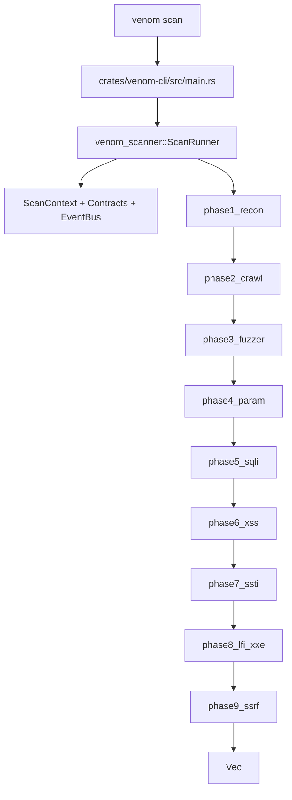

# Runtime Consolidation 5.3 — Source Inventory, Runtime Boundaries, and Migration Map

Scope: documentation and migration planning only. No runtime behavior, API, or feature
semantics were changed in this milestone.

Inputs used for this inventory:

- `outputs/runtime_inventory_scanner_graph.json`
- `cargo xtask architecture` (structure + source reachability gate)
- static code-path tracing from:
  - `crates/venom-cli/src/main.rs`
  - `crates/venom-scanner/src/lib.rs`
  - `crates/venom-scanner/src/runner.rs`
  - `crates/venom-scanner/src/phases/*`

## 1) Crate-level inventory (snapshot)

| Crate | Source files | Reachable (`src`) | Default-feature reachable | Notes |
| --- | ---: | ---: | ---: | --- |
| `venom-core` | 9 | 9 | 9 | Core contracts/types baseline |
| `venom-cli` | 1 | 1 | 1 | Entry-point only |
| `venom-proxy` | 2 | 2 | 2 | `mitm` crate boundary |
| `venom-api` | 1 | 1 | 1 | API server crate boundary |
| `venom-scanner` | 123 | 97 | 83 | 26 files are unreachable/unmapped at root |

Ground-truth source inventory was generated from:

- `cargo xtask architecture` + `xtask` JSON export path:
  - `outputs/runtime_inventory_scanner_graph.json`
- `venom-scanner` reachability extraction (non-test sources):
  - `ReachabilityRows` -> `Reachable` and `DefaultFeatureReachable`

For `venom-scanner` the counts are:

- total sources: 123
- reachable in at least one feature set: 97
- reachable with default features: 83
- reachable only under non-default features: 14
- non-reachable (must remain explicit in allowlist): 26

Non-default reachable files are intentionally treated as `platform shell` under `scanning`-adjacent, feature-gated surfaces:

- `compliance.rs`
- `distributed.rs`
- `lua_engine.rs`
- `ml.rs`
- `monitoring.rs`
- `plugin.rs`
- `plugins/*.rs`
- `threat_intelligence.rs`

They are currently compiled only when corresponding features are enabled and are therefore excluded from the "default runtime" migration map.

## 2) `venom-scanner` status by lifecycle

### A. Executed by `venom scan` today (legacy runtime)

This is currently the only production CLI scan path:

```text
venom-cli/src/main.rs
 └─ crate::ScanRunner
     └─ crates/venom-scanner/src/runner.rs
         ├─ context.rs
         ├─ contracts.rs
         ├─ event_bus.rs
         ├─ logging.rs
         └─ phases/
             ├─ phase1_recon
             ├─ phase2_crawl
             ├─ phase3_fuzzer
             ├─ phase4_param
             ├─ phase5_sqli
             ├─ phase6_xss
             ├─ phase7_ssti
             ├─ phase8_lfi_xxe
             └─ phase9_ssrf
                 └─ ScanFinding
```

- **Compiled (default features):** yes
- **Reachable:** yes
- **Exported API usage:** `ScanRunner`, `ScanPhase`, `ScanContext`, `ScanFinding`

### B. In-tree but not yet scan-executed (decision/runtime branch)

These modules are reachable and/or exported today, but are **not used by `venom scan`** yet:

- `api_evidence`, `api_observation`, `api_reasoning`
- `web_actions`, `web_planning`, `web_reasoning`, `web_decision`, `web_execution`
- `web_runtime` and `web_runtime/api_visibility/*`
- `http_evidence` (`request_broker`)
- `runtime_budget`
- `knowledge`
- `experience`
- `planner`, `decision_loop`, `decision_runner`
- `payload_strategy`, `payload_strategies/*`
- `semantic`, `semantic/entity`, `semantic/extractor`
- `defense/*`
- `adaptive/*`
- `advanced_detection`

### C. Feature-scoped shell / platform surfaces

Not on the runtime path and should be treated as platform/application scope:

- `distributed*`
- `lua_engine`
- `plugins/*`, `plugin`
- `ml`
- `compliance`
- `monitoring`
- `threat_intelligence`
- `persistence`
- `reporting`
- `realtime`
- `dashboard`
- `post_exploitation`

### D. Unreachable / quarantine files (explicitly allowed for now)

These are intentionally not on active module graph execution:

- `src/api_evidence_tests.rs`
- `src/web_runtime_tests.rs`
- `src/anomaly/baseline.rs`
- `src/anomaly/confidence.rs`
- `src/anomaly/detector.rs`
- `src/anomaly/metrics.rs`
- `src/anomaly/pipeline.rs`
- `src/anomaly/rules.rs`
- `src/anomaly/statistics.rs`
- `src/api_evidence/profiled_tests.rs`
- `src/distributed/heartbeat.rs`
- `src/distributed/protocol.rs`
- `src/distributed/queue.rs`
- `src/distributed/result.rs`
- `src/distributed/retry.rs`
- `src/distributed/scheduler.rs`
- `src/distributed/worker.rs`
- `src/lua/cache.rs`
- `src/lua/executor.rs`
- `src/lua/history.rs`
- `src/lua/loader.rs`
- `src/lua/mod.rs`
- `src/lua/registry.rs`
- `src/lua/sandbox.rs`
- `src/lua/types.rs`
- `src/web_runtime/api_visibility/differential_tests.rs`

## 3) Keep / Migrate / Delete decision for 5.3 milestone

- **Keep (active):** legacy phase runner chain and its direct dependencies (`phases`, `runner`, `ScanFinding`, `ScanContext`, `contracts`, `event_bus`, `logging`).
- **Keep (in-tree but not active):** decision runtime modules above; no new behavior is enabled from them yet.
- **Migrate:** all platform shell crates/features (`distributed`, `plugins`, `dashboard`, `reporting`, `post_exploitation`, `ml`, `monitoring`, `compliance`, `threat_intel`).
- **Quarantine cleanup:** the 26 files listed above must be moved into clear destinations in follow-up PRs:
  - remove if obsolete,
  - re-home to dedicated migration branches,
  - or convert into purpose-specific, test-only modules.

## 4) Migration boundaries to freeze next

1. `venom scan` stays explicit **legacy** in Runtime Consolidation 5.3.
2. No new capability/behavior/feature changes in this milestone.
3. No Relation Engine expansion and no planner algorithm upgrades in this milestone.
4. Every module movement/removal in 5.4 must start with an explicit boundary ADR.
5. `cargo xtask architecture` + allowlist must be the single enforcement point for source reachability debt.

## 5) Runtime map (high-level)



```mermaid
flowchart TD
  DecisionPath[StandardWebDecisionRuntime (in-tree)]
  DecisionPath --> RuntimeBudget[RuntimeBudget / transport contracts]
  RuntimeBudget --> WebRuntime[web_runtime + web_execution]
  WebRuntime --> Planner[planner / decision_loop]
  Planner --> Evidence[evidence + knowledge + experience]
  Evidence --> Verifier[verification]
  Verifier --> Audit[audit artifacts / reports]
```

## 6) 5.4 sequencing (recommended)

1. Finish quarantine decisions for `anomaly`, `distributed`, and `lua` with separate PRs.
2. Produce 1 ADR covering `legacy runtime` vs `decision runtime` vs `platform shell`.
3. Add explicit tests asserting scan path and module boundary behavior.
4. After boundary freeze, introduce decision runtime command path in a dedicated follow-up milestone.

Current milestone output: `work/venom/outputs/runtime_inventory_scanner_graph.json` + this document.
