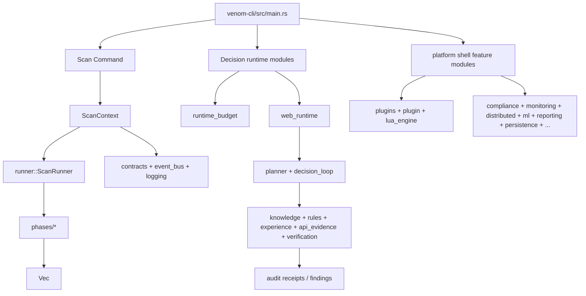

# Runtime Consolidation 5.5 — Runtime Inventory and Migration Matrix

Status: **implemented (docs + migration planning only)**.

This milestone is the hardening pass before we touch behavior.

- No new capabilities.
- No planner changes.
- No semantic model expansion.
- No scanning feature additions.
- No runtime behavior changes.

We keep one goal only:
produce and lock a complete runtime ownership map and a migration sequence that can
be executed one subsystem at a time.

## 1) Evidence used for this inventory

- `cargo run --locked -p xtask -- architecture`
- `cargo check -p venom-scanner --locked`
- `cargo check -p venom-scanner --locked --no-default-features`
- `cargo check -p venom-scanner --locked --features full`
- direct execution tracing in:
  - `crates/venom-cli/src/main.rs`
  - `crates/venom-scanner/src/lib.rs`
  - `crates/venom-scanner/src/runner.rs`
  - `crates/venom-scanner/src/phases/*`
- `xtask` source reachability allowlist in
  `xtask/src/architecture/reachability.rs`

## 2) `venom-scanner` module inventory

- Total Rust source files (`src`, including feature-gated): **101**
- Reachable from crate module graph: **97**
- Reachable with default feature set (`core + scanning + detection`): **83**
- Explicitly quarantined/allowlisted and intentionally unreachable: **4**

### 2.1) Keep / Migrate / Delete

**Keep**
- Legacy default scan runtime (`context`, `contracts`, `event_bus`, `logging`,
  `runner`, `phases/*`, `sdk`)
- `legacy-support` modules (`auth`, `cache`, `config`, `config_loader`, `error`,
  `metrics`)
- `decision-runtime` modules (in-tree and compiled, but not active under default CLI scan path)

**Migrate**
- `advanced_detection`, `anomaly`
- `compliance`, `monitoring`, `threat_intelligence`, `distributed`, `ml`
- `persistence`, `reporting`, `realtime`, `dashboard`, `post_exploitation`
- `plugins`, `plugin`, `lua_engine`
- `threat-intel`, other optional feature modules

**Delete**
- No explicit delete in this milestone. Deletions stay off until ADR-backed replacement
  is documented.

### 2.2) Execution ownership matrix

| Module group | Default feature compiled | Reachable | Exported | Executed by `venom scan` | Class |
| --- | --- | --- | --- | --- | --- |
| `context.rs` | ✅ | ✅ | ✅ | ✅ | `legacy-runner-core` |
| `contracts.rs` | ✅ | ✅ | ✅ | ✅ | `legacy-runner-core` |
| `event_bus.rs` | ✅ | ✅ | ✅ | ✅ | `legacy-runner-core` |
| `logging.rs` | ✅ | ✅ | ✅ | ✅ | `legacy-runner-core` |
| `runner.rs` | ✅ | ✅ | ✅ | ✅ | `legacy-runner` |
| `phases/*` (`phase1_recon..phase9_ssrf`) | ✅ | ✅ | ✅ | ✅ | `legacy-runner` |
| `sdk.rs` | ✅ | ✅ | ✅ | ❌ | `legacy-support` |
| `waf.rs` | ✅ | ✅ | ✅ | ❌ | `legacy-support` |
| `api.rs` / `api_evidence.rs` / `api_gateway.rs` / `api_observation.rs` / `api_reasoning.rs` | ✅ | ✅ | ✅ | ❌ | `decision-runtime` |
| `knowledge.rs` / `experience.rs` / `rules.rs` / `planner.rs` | ✅ | ✅ | ✅ | ❌ | `decision-runtime` |
| `verification.rs` | ✅ | ✅ | ✅ | ❌ | `decision-runtime` |
| `adaptive/*` | ✅ | ✅ | ✅ | ❌ | `decision-runtime` |
| `payload_strategy.rs` / `payload_strategies/*` | ✅ | ✅ | ✅ | ❌ | `decision-runtime` |
| `web_actions.rs` / `web_planning.rs` / `web_reasoning.rs` / `web_decision.rs` / `web_execution.rs` / `web_runtime.rs` | ✅ | ✅ | ✅ | ❌ | `decision-runtime` |
| `web_verification.rs` / `runtime_budget.rs` / `http_evidence.rs` / `decision_loop.rs` / `decision_runner.rs` | ✅ | ✅ | ✅ | ❌ | `decision-runtime` |
| `defense/*` | ✅ | ✅ | ✅ | ❌ | `decision-runtime` |
| `semantic.rs` / `semantic/*` | ✅ | ✅ | ✅ | ❌ | `decision-runtime` |
| `advanced_detection.rs` / `anomaly.rs` | ✅ | ✅ | ✅ | ❌ | `platform-shell` |
| `compliance.rs` | ❌ (feature) | ✅ | ✅ | ❌ | `platform-shell` |
| `monitoring.rs` | ❌ (feature) | ✅ | ✅ | ❌ | `platform-shell` |
| `distributed.rs` | ❌ (feature) | ✅ | ✅ | ❌ | `platform-shell` |
| `threat_intelligence.rs` | ❌ (feature) | ✅ | ✅ | ❌ | `platform-shell` |
| `ml.rs` | ❌ (feature) | ✅ | ✅ | ❌ | `platform-shell` |
| `plugin.rs` / `plugins/*` / `lua_engine.rs` | ❌ (feature) | ✅ | ✅ | ❌ | `platform-shell` |
| `persistence.rs` / `reporting.rs` / `realtime.rs` / `dashboard.rs` / `post_exploitation.rs` | ✅ | ✅ | ✅ | ❌ | `platform-shell` |
| `config.rs` / `config_loader.rs` / `cache.rs` / `error.rs` / `metrics.rs` | ✅ | ✅ | ✅ | ❌ | `legacy-support` |
| `api_evidence_tests.rs` | ✅ (allowlist) | ✅ | ✅ | ❌ | `test-scaffold` |
| `web_runtime_tests.rs` | ✅ (allowlist) | ✅ | ✅ | ❌ | `test-scaffold` |
| `api_evidence/profiled_tests.rs` | ✅ (allowlist) | ✅ | ✅ | ❌ | `test-scaffold` |
| `web_runtime/api_visibility/differential_tests.rs` | ✅ (allowlist) | ✅ | ✅ | ❌ | `test-scaffold` |

## 3) Class semantics

- `legacy-runner-core` / `legacy-runner`: active default execution path for `venom scan`.
- `decision-runtime`: complete in-tree reasoning/verification stack, currently not default CLI.
- `platform-shell`: optional product modules not part of default scan runtime.
- `legacy-support`: shared core utilities used by scanner and runtime internals.
- `test-scaffold`: explicit allowlisted test-only or fixture-only modules.

No module can move class without ADR or migration ticket.

## 4) Migration plan (docs + wiring only)

### Phase 5.5.1 — Publish and lock the map

1. Keep this document as the current authoritative inventory.
2. Link ADR 0015 from `docs/index.md` and ADR index.
3. Confirm each platform module has owner + target.
4. Require one migration ticket per subsystem before nontrivial edits.

### Phase 5.5.2 — Subsystem epics (one at a time)

1. **Detection shell** (`advanced_detection`, `anomaly`)
2. **Platform compliance** (`compliance`, `monitoring`, `threat_intelligence`)
3. **Distributed/ML shell** (`distributed`, `ml`)
4. **Plugins / Lua** (`plugin`, `plugins/*`, `lua_engine`)
5. **Persistence/reporting shell** (`persistence`, `reporting`, `realtime`, `dashboard`, `post_exploitation`)

Each epic must only do:

- explicit boundary docs/deprecation notes,
- explicit ADR/ticket,
- migration notes and ownership map updates.

#### Epic backlog and ownership (pre-created)

The following epic records are the initial handoff points for the next three to six PRs:

- **Epic A — detection-shell**
  - Scope: `advanced_detection`, `anomaly`
  - Owner: `team-runtime-science`
  - Handoff doc: [5.5-epic-A-detection-shell.md](runtime-consolidation-5.5-epic-A-detection-shell.md)
  - Must include:
    - module boundary note (`docs/adr` or migration doc update)
    - explicit `platform-shell` execution note in API docs
    - deprecation or migration ticket reference

- **Epic B — compliance-shell**
  - Scope: `compliance`, `monitoring`, `threat_intelligence`
  - Owner: `team-platform-observability`
  - Handoff doc: [5.5-epic-B-compliance-shell.md](runtime-consolidation-5.5-epic-B-compliance-shell.md)
  - Must include:
    - compatibility matrix (feature-gated vs default scan)
    - runtime path note in docs
    - migration ticket reference

- **Epic C — distributed-ml shell**
  - Scope: `distributed`, `ml`
  - Owner: `team-platform-core`
  - Handoff doc: [5.5-epic-C-distributed-ml-shell.md](runtime-consolidation-5.5-epic-C-distributed-ml-shell.md)
  - Must include:
    - API stability note
    - explicit "non-default CLI path" banner
    - migration ticket reference

- **Epic D — plugin-lua shell**
  - Scope: `plugin`, `plugins/*`, `lua_engine`
  - Owner: `team-plugins`
  - Handoff doc: [5.5-epic-D-plugin-lua-shell.md](runtime-consolidation-5.5-epic-D-plugin-lua-shell.md)
  - Must include:
    - boundary and execution path note (`plugin` and `plugins` are not scan defaults)
    - source-of-truth mapping update in this milestone doc
    - migration ticket reference

- **Epic E — persistence-reporting shell**
  - Scope: `persistence`, `reporting`, `realtime`, `dashboard`, `post_exploitation`
  - Owner: `team-platform-runtime`
  - Handoff doc: [5.5-epic-E-persistence-reporting-shell.md](runtime-consolidation-5.5-epic-E-persistence-reporting-shell.md)
  - Must include:
    - explicit feature-gated behavior statement in docs
    - migration ticket reference
    - no CLI runtime path change in this milestone

### Phase 5.5.3 — Runtime truth preconditions

- `cargo check -p venom-scanner --locked` keeps passing.
- `cargo run --locked -p xtask -- architecture` keeps passing.
- `docs/index.md` and `docs/adr/README.md` point to current status.
- No item moves from `platform-shell` to `legacy` without ADR or ticket.

## 5) Runtime truth map

## 6) Acceptance and local check notes

- `cargo test --workspace --all-features --locked` is not a required green guarantee for
  `RuntimeConsolidation-5.5` because local environment restrictions currently block
  a subset of `venom-core` doctests (`os error 4551` from App Control policy). That is
  tracked separately and already documented in test notes.
- 5.5 is considered complete when architecture checks, class registry, and ADR
  links are stable and reviewed.
