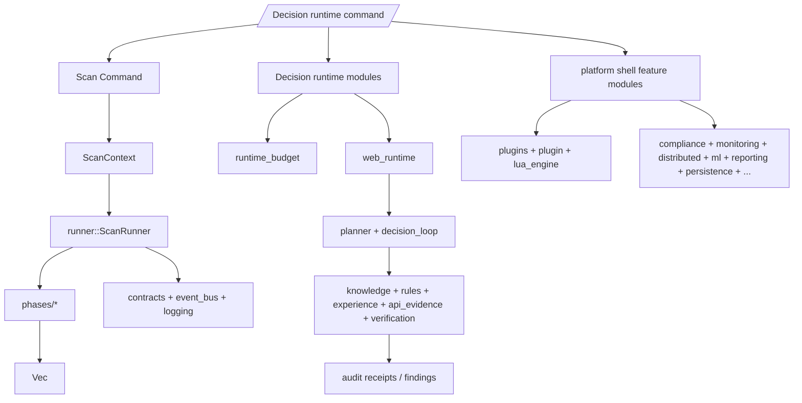

# Runtime Consolidation 5.5 — Runtime Inventory and Migration Matrix

Status: drafted (docs and migration planning only).

This milestone follows 5.4 and is intentionally limited to reality-mapping, wiring,
and boundary classification.

Scope:

- No new capabilities.
- No planner or decision-engine feature changes.
- No fuzzing, semantic, or runtime behavior changes.
- No feature additions.
- Focus: one concrete inventory and one explicit keep/migrate decision surface.

## 1) Ground truth used for this inventory

- `cargo xtask architecture` (workspace graph + module policy + reachability gate)
- Direct tracing of `venom scan` runtime path in:
  - `crates/venom-cli/src/main.rs`
  - `crates/venom-scanner/src/lib.rs`
  - `crates/venom-scanner/src/runner.rs`
  - `crates/venom-scanner/src/phases/*`
- `src` ownership and allowlist declared in `xtask/src/architecture/reachability.rs`

## 2) `venom-scanner` module inventory (as of 2026-08-04)

- Total Rust source files (including feature-gated): **101**
- Reachable from crate module graph: **97**
- Reachable with default feature set (`core + scanning + detection`): **83**
- Unreferenced and explicitly quarantined for now: **4**

### Quarantined / scaffold test files (allowed by `xtask` policy)

- `src/api_evidence_tests.rs`
- `src/web_runtime_tests.rs`
- `src/api_evidence/profiled_tests.rs`
- `src/web_runtime/api_visibility/differential_tests.rs`

These are allowed as deliberate test-only scaffolds; no new runtime behavior.

## 3) Module-by-module execution ownership matrix

| Module | Default compiled | Reachable | Exported | Executed by `venom scan` | Ownership class |
| --- | --- | --- | --- | --- | --- |
| `context.rs` | ✅ | ✅ | ✅ | ✅ | `legacy-runner-core` |
| `contracts.rs` | ✅ | ✅ | ✅ | ✅ | `legacy-runner-core` |
| `event_bus.rs` | ✅ | ✅ | ✅ | ✅ (indirect) | `legacy-runner-core` |
| `logging.rs` | ✅ | ✅ | ✅ | ✅ (indirect) | `legacy-runner-core` |
| `phases/mod.rs` | ✅ | ✅ | ✅ (module) | ✅ | `legacy-runner` |
| `phases/phase1_recon.rs` | ✅ | ✅ | ✅ (through `phases`) | ✅ | `legacy-runner` |
| `phases/phase2_crawl.rs` | ✅ | ✅ | ✅ (through `phases`) | ✅ | `legacy-runner` |
| `phases/phase3_fuzzer.rs` | ✅ | ✅ | ✅ (through `phases`) | ✅ | `legacy-runner` |
| `phases/phase4_param.rs` | ✅ | ✅ | ✅ (through `phases`) | ✅ | `legacy-runner` |
| `phases/phase5_sqli.rs` | ✅ | ✅ | ✅ (through `phases`) | ✅ | `legacy-runner` |
| `phases/phase6_xss.rs` | ✅ | ✅ | ✅ (through `phases`) | ✅ | `legacy-runner` |
| `phases/phase7_ssti.rs` | ✅ | ✅ | ✅ (through `phases`) | ✅ | `legacy-runner` |
| `phases/phase8_lfi_xxe.rs` | ✅ | ✅ | ✅ (through `phases`) | ✅ | `legacy-runner` |
| `phases/phase9_ssrf.rs` | ✅ | ✅ | ✅ (through `phases`) | ✅ | `legacy-runner` |
| `runner.rs` | ✅ | ✅ | ✅ | ✅ | `legacy-runner` |
| `sdk.rs` | ✅ | ✅ | ✅ | ❌ | `legacy-support` |
| `waf.rs` | ✅ | ✅ | ✅ | ❌ | `legacy-support` |
| `adaptive/*` | ✅ | ✅ | ✅ | ❌ | `decision-support` |
| `knowledge.rs` | ✅ | ✅ | ✅ | ❌ | `decision-runtime` |
| `experience.rs` | ✅ | ✅ | ✅ | ❌ | `decision-runtime` |
| `rules.rs` | ✅ | ✅ | ✅ | ❌ | `decision-runtime` |
| `planner.rs` | ✅ | ✅ | ✅ | ❌ | `decision-runtime` |
| `verification.rs` | ✅ | ✅ | ✅ | ❌ | `decision-runtime` |
| `payload_strategy.rs` | ✅ | ✅ | ✅ | ❌ | `decision-runtime` |
| `payload_strategies/*` | ✅ | ✅ | ✅ | ❌ | `decision-runtime` |
| `web_actions.rs` | ✅ | ✅ | ✅ | ❌ | `decision-runtime` |
| `web_planning.rs` | ✅ | ✅ | ✅ | ❌ | `decision-runtime` |
| `web_reasoning.rs` | ✅ | ✅ | ✅ | ❌ | `decision-runtime` |
| `web_verification.rs` | ✅ | ✅ | ✅ | ❌ | `decision-runtime` |
| `web_decision.rs` | ✅ | ✅ | ✅ | ❌ | `decision-runtime` |
| `web_execution.rs` | ✅ | ✅ | ✅ | ❌ | `decision-runtime` |
| `web_runtime.rs` | ✅ | ✅ | ✅ | ❌ | `decision-runtime` |
| `http_evidence.rs` | ✅ | ✅ | ✅ | ❌ | `decision-runtime` |
| `runtime_budget.rs` | ✅ | ✅ | ✅ | ❌ | `decision-runtime` |
| `decision_loop.rs` | ✅ | ✅ | ✅ | ❌ | `decision-runtime` |
| `decision_runner.rs` | ✅ | ✅ | ✅ | ❌ | `decision-runtime` |
| `api.rs` | ✅ | ✅ | ✅ | ❌ | `decision-runtime` |
| `api_evidence.rs` | ✅ | ✅ | ✅ | ❌ | `decision-runtime` |
| `api_gateway.rs` | ✅ | ✅ | ✅ | ❌ | `decision-runtime` |
| `api_reasoning.rs` | ✅ | ✅ | ✅ | ❌ | `decision-runtime` |
| `api_observation.rs` | ✅ | ✅ | ✅ | ❌ | `decision-runtime` |
| `api_evidence/profiled.rs` | ✅ | ✅ | ✅ | ❌ | `decision-runtime` |
| `api_evidence/profiled/*.rs` | ✅ | ✅ | ✅ | ❌ | `decision-runtime` |
| `defense/*` | ✅ | ✅ | ✅ | ❌ | `decision-runtime` |
| `semantic.rs` | ✅ | ✅ | ✅ | ❌ | `decision-runtime` |
| `semantic/entity.rs` | ✅ | ✅ | ✅ | ❌ | `decision-runtime` |
| `semantic/extractor.rs` | ✅ | ✅ | ✅ | ❌ | `decision-runtime` |
| `advanced_detection.rs` | ✅ | ✅ | ✅ | ❌ | `platform-shell` |
| `anomaly.rs` | ✅ | ✅ | ✅ | ❌ | `platform-shell` |
| `compliance.rs` | ❌ (feature: compliance) | ✅ | ✅ | ❌ | `platform-shell` |
| `monitoring.rs` | ❌ (feature: monitoring) | ✅ | ✅ | ❌ | `platform-shell` |
| `distributed.rs` | ❌ (feature: distributed) | ✅ | ✅ | ❌ | `platform-shell` |
| `threat_intelligence.rs` | ❌ (feature: threat-intel) | ✅ | ✅ | ❌ | `platform-shell` |
| `ml.rs` | ❌ (feature: ml) | ✅ | ✅ | ❌ | `platform-shell` |
| `plugin.rs` | ❌ (feature: plugins) | ✅ | ✅ | ❌ | `platform-shell` |
| `plugins/*` | ❌ (feature: plugins) | ✅ | ✅ | ❌ | `platform-shell` |
| `lua_engine.rs` | ❌ (feature: plugins) | ✅ | ✅ | ❌ | `platform-shell` |
| `persistence.rs` | ✅ | ✅ | ✅ | ❌ | `platform-shell` |
| `reporting.rs` | ✅ | ✅ | ✅ | ❌ | `platform-shell` |
| `realtime.rs` | ✅ | ✅ | ✅ | ❌ | `platform-shell` |
| `dashboard.rs` | ✅ | ✅ | ✅ | ❌ | `platform-shell` |
| `post_exploitation.rs` | ✅ | ✅ | ✅ | ❌ | `platform-shell` |
| `config.rs` | ✅ | ✅ | ✅ | ❌ | `legacy-support` |
| `config_loader.rs` | ✅ | ✅ | ✅ | ❌ | `legacy-support` |
| `cache.rs` | ✅ | ✅ | ✅ | ❌ | `legacy-support` |
| `auth.rs` | ✅ | ✅ | ✅ | ❌ | `legacy-support` |
| `error.rs` | ✅ | ✅ | ✅ | ❌ | `legacy-support` |
| `metrics.rs` | ✅ | ✅ | ✅ | ❌ | `legacy-support` |
| `api_evidence_tests.rs` | ✅ (allowlisted) | ✅ | ✅ | ❌ | `test-scaffold` |
| `web_runtime_tests.rs` | ✅ (allowlisted) | ✅ | ✅ | ❌ | `test-scaffold` |

### Platform runtime class definitions

- `legacy-runner-core` and `legacy-runner`: executed by `venom scan` today.
- `decision-runtime`: in-tree reasoning/verification stack, compiled but not on CLI scan path.
- `platform-shell`: feature-scoped product-layer modules, not on default scan path.
- `legacy-support`: helper/shared utilities used by the current pipeline.
- `test-scaffold`: allowlisted scaffolds.

## 4) Keep / Migrate / Delete matrix for 5.5

| Module | Decision | Resulting state |
| --- | --- | --- |
| Legacy scan path (`context`, `contracts`, `event_bus`, `logging`, `runner`, `phases/*`, `sdk`) | `Keep` | Remains the active executable runtime until switched by a dedicated `venom scan` runtime command milestone. |
| Decision runtime modules (`knowledge`, `rules`, `planner`, `verification`, `api_*`, `web_*`, `adaptive`, `decision_*`, `defense/*`, `payload_*`, `runtime_budget`, `http_evidence`) | `Keep` | Kept as shipped reasoning runtime, but explicitly not promoted to default CLI execution in this cycle. |
| Platform shell features (`advanced_detection`, `anomaly`, `compliance`, `monitoring`, `distributed`, `threat_intelligence`, `ml`, `plugins`, `plugin`, `lua_engine`) | `Migrate` | Migrate out of scan truth in dedicated epic(s), or keep behind explicit migration PRs with explicit ADR and interface docs. |
| Platform shell crates under `scanning` (`persistence`, `reporting`, `realtime`, `dashboard`, `post_exploitation`) | `Migrate` | Keep in-tree with explicit boundary and deprecation banner; do not treat as scan execution for release milestones. |
| Scaffold tests (`api_evidence_tests.rs`, `web_runtime_tests.rs`, `api_evidence/profiled_tests.rs`, `web_runtime/api_visibility/differential_tests.rs`) | `Keep` only in allowlist |
| Unclear/obsolete code found in future reviews | `Delete` (case-by-case) | Requires explicit ADR + migration log before removal. |

## 5) 5.5 execution plan (no behavior changes)

### Sprint 5.5.1 — Finalized classification (this milestone)

1. Publish this inventory under PR with owner sign-off.
2. Add/update ADR 0015 status to track explicit boundary intent.
3. Lock milestone boundary in `docs/index.md` and `docs/migrations/runtime-consolidation-*.md`.
4. Ensure all future PRs in this track include one of:
   - `Keep` with execution-path link,
   - `Migrate` with ADR / migration-ticket,
   - `Delete` with clear replacement contract.

### Sprint 5.5.2 — Scoped migration prep (docs + wiring only)

1. For each platform-shell module, record one owner and a target integration milestone.
2. Add `deprecated`-style docs and runtime boundary notes where a module is compiled but not executable by default.
3. Split this migration into sub-epics by area (`threat-intel`, `platform reporting`, `detection`, `distributed`, etc.) so no milestone touches all at once.

### Sprint 5.5.3 — Readiness (pre-acceptance)

- `cargo xtask architecture` remains green.
- `cargo check -p venom-scanner --locked` remains green.
- `docs/index.md` and `docs/adr/README.md` show current milestone status.
- Migration decisions are documented and no item can move from `platform-shell` to `Keep` without an ADR or migration ticket.

## 6) Runtime truth map (updated)

